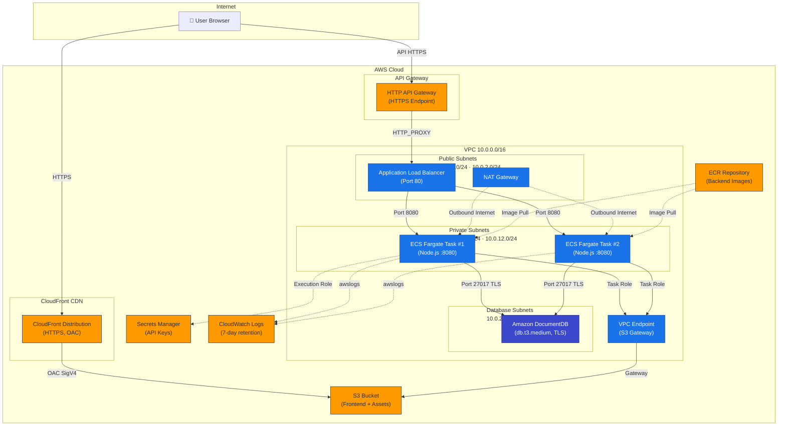
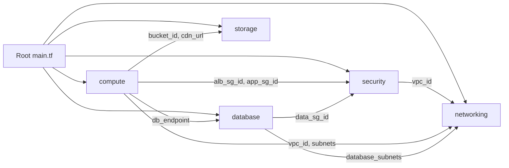

# 5XRestaurant — System & AWS Architecture

> **Last Updated:** 2026-04-24  
> **Project Codename:** EatEase Restaurant  
> **Infrastructure as Code:** Terraform (AWS Provider v6.42.0)  
> **Target Region:** `us-east-1`

---

## Table of Contents

1. [High-Level Architecture](#1-high-level-architecture)
2. [AWS Infrastructure Details (Terraform Provisioning)](#2-aws-infrastructure-details-terraform-provisioning)
3. [Application Components](#3-application-components)
4. [State Management & Deployment (Infrastructure as Code)](#4-state-management--deployment-infrastructure-as-code)
5. [Security Posture Assessment](#5-security-posture-assessment)
6. [Scalability Assessment](#6-scalability-assessment)

---

## 1. High-Level Architecture

### 1.1 Architectural Model

The 5XRestaurant system follows a **three-tier, cloud-native architecture** deployed entirely on AWS:

| Tier            | Technology                        | AWS Service                          |
|-----------------|-----------------------------------|--------------------------------------|
| **Presentation** | React 19 SPA (Vite)              | S3 + CloudFront CDN                 |
| **Application**  | Node.js / Express 5 (containerized) | ECS Fargate (behind ALB + API Gateway) |
| **Data**         | MongoDB-compatible (Mongoose ODM)| Amazon DocumentDB                    |

The frontend is a **statically built** React Single-Page Application served via CloudFront CDN for global, low-latency delivery. The backend is a **containerized Node.js API** running on serverless ECS Fargate tasks in private subnets, exposed through an Application Load Balancer (HTTP) with an API Gateway overlay providing HTTPS termination. The database is Amazon DocumentDB (MongoDB-compatible), deployed in isolated database subnets.

### 1.2 Data Communication Flow

```
User (Browser)
  │
  │ HTTPS
  ▼
CloudFront CDN ──── S3 Bucket (Static Frontend Assets)
  │
  │ API Calls (HTTPS)
  ▼
API Gateway (HTTP API — HTTPS Endpoint)
  │
  │ HTTP_PROXY Integration
  ▼
Application Load Balancer (ALB — Public Subnets, Port 80)
  │
  │ Forward to Target Group (Port 8080)
  ▼
ECS Fargate Tasks (Private Subnets, Port 8080)
  │
  ├── AWS S3 (Image/Asset uploads via Task Role)
  ├── AWS Secrets Manager (Secrets injection at task start)
  └── Amazon DocumentDB (Port 27017, TLS-encrypted, via data_sg)
```

### 1.3 Architecture Diagram



---

## 2. AWS Infrastructure Details (Terraform Provisioning)

All infrastructure is provisioned via **Terraform** using modular composition. The root `main.tf` orchestrates five modules: `networking`, `security`, `compute`, `database`, and `storage`.

### 2.1 Networking & Security

#### Networking Module (`tf/networking/`)

| Resource | Terraform Type | Configuration | Purpose |
|----------|---------------|---------------|---------|
| **VPC** | `terraform-aws-modules/vpc/aws` (v5.0.0) | CIDR `10.0.0.0/16`, 2 AZs | Isolated network boundary for all resources |
| **Public Subnets** | (via module) | `10.0.1.0/24`, `10.0.2.0/24` | Host the ALB and NAT Gateway (internet-facing) |
| **Private Subnets** | (via module) | `10.0.11.0/24`, `10.0.12.0/24` | Host ECS Fargate tasks (no direct internet access) |
| **Database Subnets** | (via module) | `10.0.21.0/24`, `10.0.22.0/24` | Isolated subnets for DocumentDB |
| **NAT Gateway** | (via module) | Single NAT, shared across AZs | Provides outbound internet for private subnets (ECR pulls, external APIs) |
| **S3 VPC Endpoint** | `aws_vpc_endpoint` | Gateway type, attached to private route tables | Enables ECS tasks to access S3 without traversing NAT (cost optimization) |
| **DNS** | (via module) | `enable_dns_hostnames = true`, `enable_dns_support = true` | Required for VPC endpoints and service discovery |

#### Security Module (`tf/security/`)

| Resource | Terraform Type | Inbound Rules | Purpose |
|----------|---------------|---------------|---------|
| **ALB Security Group** | `aws_security_group` (`alb_sg`) | TCP/80 from `0.0.0.0/0` | Allows HTTP traffic from the internet to the ALB |
| **App Security Group** | `aws_security_group` (`app_sg`) | TCP/8080 from `alb_sg` only | ECS tasks accept traffic exclusively from the ALB |
| **Data Security Group** | `aws_security_group` (`data_sg`) | TCP/27017 from `app_sg` only | DocumentDB accepts connections only from ECS tasks |

> **Security Pattern:** A strict **three-tier security group chain** (`Internet → ALB SG → App SG → Data SG`) ensures defense-in-depth. No component can be accessed directly by a lower-trust tier.

#### IAM Roles & Policies (defined in `tf/compute/`)

| IAM Resource | Type | Permissions | Purpose |
|-------------|------|-------------|---------|
| **ECS Execution Role** | `aws_iam_role` | `AmazonECSTaskExecutionRolePolicy` + `secretsmanager:GetSecretValue` (scoped to project secret ARN) | Pull images from ECR, push logs to CloudWatch, retrieve secrets at container startup |
| **App Task Role** | `aws_iam_role` | `s3:GetObject`, `s3:PutObject`, `s3:DeleteObject`, `s3:ListBucket` (scoped to project S3 bucket) + `ssmmessages:*` | Application-level S3 access for image uploads; ECS Exec support for debugging |

> **Principle of Least Privilege:** The Execution Role can only read the specific Secrets Manager secret for this project. The Task Role can only access the designated S3 bucket. Neither role has admin or wildcard resource permissions (except SSM messages for ECS Exec, which is `Resource: *` by AWS requirement).

### 2.2 Compute

#### Compute Module (`tf/compute/`)

| Resource | Terraform Type | Configuration | Purpose |
|----------|---------------|---------------|---------|
| **ECR Repository** | `aws_ecr_repository` | Mutable tags, `scan_on_push = true`, `force_delete = true` | Container image registry with automated vulnerability scanning |
| **ECS Cluster** | `aws_ecs_cluster` | Named `{proj_name}-cluster` | Logical grouping for Fargate tasks |
| **ECS Task Definition** | `aws_ecs_task_definition` | Fargate, `cpu=256`, `memory=512`, `awsvpc` network mode | Defines the backend container spec (Node.js on port 8080) |
| **ECS Service** | `aws_ecs_service` | `desired_count = 2`, private subnets, `enable_execute_command = true` | Maintains 2 running task replicas for availability |
| **Application Load Balancer** | `aws_lb` | Internet-facing, application type, public subnets | Distributes traffic across ECS tasks |
| **ALB Target Group** | `aws_lb_target_group` | Port 8080, HTTP, `target_type = ip`, health check on `/health` | Routes traffic to Fargate task IPs |
| **ALB Listener** | `aws_lb_listener` | Port 80, HTTP, forward action | Listens for incoming HTTP traffic |
| **API Gateway (HTTP API)** | `aws_apigatewayv2_api` | HTTP protocol, `HTTP_PROXY` integration to ALB | Provides an HTTPS endpoint (TLS termination) proxying to the ALB |
| **API Gateway Route** | `aws_apigatewayv2_route` | `ANY /{proxy+}` | Catch-all proxy route forwarding all paths to ALB |
| **API Gateway Stage** | `aws_apigatewayv2_stage` | `$default`, `auto_deploy = true` | Auto-deploying default stage |
| **Secrets Manager** | `aws_secretsmanager_secret` | `recovery_window_in_days = 0` | Stores all backend API keys and secrets (12 keys total) |
| **CloudWatch Log Group** | `aws_cloudwatch_log_group` | `/ecs/{proj_name}-backend`, 7-day retention | Centralized logging for ECS containers |

**Secrets stored in AWS Secrets Manager:**

| Secret Key | Description |
|-----------|-------------|
| `MONGODB_URL` | Full DocumentDB connection string with TLS |
| `SECRET_KEY_ACCESS_TOKEN` | JWT access token signing key |
| `SECRET_KEY_REFRESH_TOKEN` | JWT refresh token signing key |
| `STRIPE_SECRET_KEY` | Stripe payment API key |
| `STRIPE_ENPOINT_WEBHOOK_SECRET_KEY` | Stripe webhook verification |
| `STRIPE_CLI_WEBHOOK_SECRET` | Stripe CLI webhook secret |
| `EMAIL_USER` | Sender email address |
| `EMAIL_PASS` | Email app password |
| `GOOGLE_CLIENT_ID` | Google OAuth client ID |
| `GOOGLE_CLIENT_SECRET` | Google OAuth client secret |
| `GEMINI_API_KEY` | Google Gemini AI API key |
| `RESEND_API` | Resend email API key |

### 2.3 Storage & Database

#### Storage Module (`tf/storage/`)

| Resource | Terraform Type | Configuration | Purpose |
|----------|---------------|---------------|---------|
| **S3 Bucket (Assets)** | `aws_s3_bucket` | Prefix `{proj_name}-assets-` | Stores frontend build artifacts and user-uploaded images |
| **S3 Public Access Block** | `aws_s3_bucket_public_access_block` | All four blocks enabled (`true`) | Prevents any public access to the bucket |
| **S3 Bucket Policy** | `aws_s3_bucket_policy` | `s3:GetObject` for CloudFront service principal only | Grants read access exclusively to the CloudFront distribution via OAC |
| **S3 Object Upload** | `aws_s3_object` | `for_each` over `client/dist/**/*` | Deploys built frontend assets to S3 during `terraform apply` |
| **CloudFront OAC** | `aws_cloudfront_origin_access_control` | SigV4 signing, `always` behavior | Secure origin access — replaces legacy OAI |
| **CloudFront Distribution** | `aws_cloudfront_distribution` | HTTPS redirect, IPv6 enabled, default TTL 3600s | Global CDN for frontend delivery with HTTPS enforcement |

#### Database Module (`tf/database/`)

| Resource | Terraform Type | Configuration | Purpose |
|----------|---------------|---------------|---------|
| **DocumentDB Subnet Group** | `aws_docdb_subnet_group` | Uses database subnets | Places DocumentDB in isolated subnets |
| **DocumentDB Cluster** | `aws_docdb_cluster` | `engine = docdb`, `storage_encrypted = true`, `skip_final_snapshot = true` | MongoDB-compatible managed database cluster |
| **DocumentDB Instance** | `aws_docdb_cluster_instance` | `count = 1`, `db.t3.medium` | Single compute instance (cost optimization trade-off — see note below) |

> **⚠️ Design Decision — Single Instance:** The DocumentDB cluster uses `count = 1` for the instance, creating a Single Point of Failure (SPOF) for compute. This is an intentional cost-saving measure for the development environment. DocumentDB still replicates storage across 3 AZs, so data durability is maintained. For production, `count` should be increased to at least 2 for high availability.

### 2.4 Components NOT Implemented

The following components are **not present** in the Terraform configuration or codebase:

| Component | Status |
|-----------|--------|
| WAF (Web Application Firewall) | ❌ Not implemented |
| ElastiCache (Redis/Memcached) | ❌ Not implemented |
| NLB (Network Load Balancer) | ❌ Not implemented (ALB is used) |
| Lambda Functions | ❌ Not implemented |
| EC2 Instances | ❌ Not implemented (Fargate is used) |
| EKS (Kubernetes) | ❌ Not implemented (ECS is used) |
| Route 53 (DNS) | ❌ Not implemented (using default CloudFront/API Gateway domains) |
| ACM (SSL Certificates) | ❌ Not implemented (using CloudFront default cert and API Gateway managed TLS) |
| KMS (Customer-Managed Keys) | ❌ Not implemented (commented out in code as TODO for production) |
| RDS (Relational Database) | ❌ Not implemented (DocumentDB is used) |
| DynamoDB | ❌ Not implemented |

---

## 3. Application Components

### 3.1 Frontend

| Aspect | Details |
|--------|---------|
| **Framework** | React 19 |
| **Build Tool** | Vite 7 |
| **Language** | JavaScript (JSX) with TypeScript config |
| **Styling** | TailwindCSS 3 + custom CSS |
| **UI Library** | Radix UI primitives (~20 components) + Lucide React icons |
| **State Management** | Redux Toolkit (RTK) + React Redux |
| **Routing** | React Router DOM v6 |
| **HTTP Client** | Axios |
| **Animations** | Framer Motion, GSAP, Three.js, OGL |
| **Charts** | Chart.js + react-chartjs-2, Recharts |
| **Payments** | Stripe.js |
| **Auth** | Google OAuth (`@react-oauth/google`) |
| **Real-time** | Socket.IO Client |

#### Frontend Folder Structure

```
client/src/
├── assets/          # Static images, icons
├── common/          # Shared API config (SummaryApi)
├── components/      # Reusable UI components (Header, Animations, Chat, etc.)
├── contexts/        # React Context providers (SupportChat)
├── data/            # Static data files
├── hooks/           # Custom React hooks
├── layouts/         # Page layout wrappers
├── lib/             # Utility libraries
├── pages/           # 42 page components (see below)
├── provider/        # GlobalProvider wrapper
├── route/           # Route definitions
├── store/           # Redux store (userSlice, productSlice, orderSlice, tableSlice)
├── utils/           # Axios instance, error handling, fetch helpers
├── App.jsx          # Root component with layout routing
├── main.jsx         # Entry point (React DOM render)
└── index.css        # Global styles
```

#### Key Pages (42 total)

| Domain | Pages |
|--------|-------|
| **Customer** | Home, ProductListPage, ProductDisplayPage, SearchPage, BookingPage, MyOrdersPage, BillPage, Profile |
| **Auth** | Login, Register, ForgotPassword, OtpVerification, ResetPassword, VerifyEmail |
| **Table Order** | TableLoginPage, TableMenuPage, TableOrderManagementPage, TablePaymentSuccessPage, CustomerCheckinPage |
| **Admin/Dashboard** | AdminDashboard, ManagerDashboard, WaiterDashboard, CashierDashboard |
| **Management** | CategoryPage, SubCategoryPage, ProductManagementPage, TableManagementPage, BookingManagementPage, VoucherPage |
| **Kitchen** | ChefDashboard, WaiterBoardPage |
| **Chat/Support** | UnifiedChatPage, SupportChatAdmin, SupportChatCustomer |
| **Reports** | ReportPage |

#### AWS Hosting Strategy

The frontend is built via `vite build` and the resulting `dist/` directory is uploaded to S3 using Terraform's `aws_s3_object` resource with `for_each`. CloudFront serves these static files globally with:
- **HTTPS enforcement** (`viewer_protocol_policy = "redirect-to-https"`)
- **Origin Access Control (OAC)** with SigV4 signing (no public S3 access)
- **Cache behavior:** Default TTL 3600s (1 hour), max TTL 86400s (24 hours)

### 3.2 Backend

| Aspect | Details |
|--------|---------|
| **Runtime** | Node.js 20 (Alpine-based Docker image) |
| **Framework** | Express 5 |
| **Language** | JavaScript (ES Modules) |
| **Database ODM** | Mongoose 8 |
| **Auth** | JWT (jsonwebtoken) + Google OAuth |
| **Payments** | Stripe (with webhook verification) |
| **File Uploads** | Multer → AWS S3 (via `@aws-sdk/client-s3`) |
| **Email** | Nodemailer + Resend |
| **AI** | Google Generative AI (Gemini) |
| **Real-time** | Socket.IO (WebSockets for kitchen + support chat) |
| **Security** | Helmet, CORS with allowlist, cookie-parser |
| **Logging** | Morgan (dev) + CloudWatch Logs (production via awslogs driver) |
| **Container** | Docker (node:20-alpine), health check on `/health` |

#### Backend Folder Structure

```
server/
├── config/
│   ├── connectDB.js       # Mongoose connection (reads MONGODB_URL from env)
│   ├── sendEmail.js       # Nodemailer/Resend configuration
│   └── stripe.js          # Stripe SDK initialization
├── controllers/           # 18 controllers (business logic)
│   ├── user.controller.js
│   ├── product.controller.js
│   ├── tableOrder.controller.js   # Includes Stripe webhook handler
│   ├── payment.controller.js
│   ├── chat.controller.js         # AI chat (Gemini)
│   ├── kitchen.controller.js
│   └── ... (14 more)
├── middleware/
│   ├── auth.js            # JWT verification middleware
│   ├── Admin.js           # Admin role check
│   ├── roleAuth.js        # Role-based access control
│   └── multer.js          # File upload middleware
├── models/                # 13 Mongoose models
│   ├── user.model.js
│   ├── product.model.js
│   ├── tableOrder.model.js
│   ├── payment.model.js
│   ├── booking.model.js
│   ├── voucher.model.js
│   ├── aiChat.model.js
│   └── ... (6 more)
├── route/                 # 17 Express route files
├── services/
│   └── menu.service.js    # Menu business logic service
├── socket/
│   ├── supportChat.socket.js   # Customer ↔ Admin real-time chat
│   └── kitchen.socket.js       # Kitchen order status broadcasts
├── utils/                 # 12 utility files
│   ├── uploadImageS3.js   # S3 upload via AWS SDK (uses Task Role, no keys)
│   ├── generatedAccessToken.js
│   ├── generatedRefreshToken.js
│   ├── qrCodeGenerator.js
│   └── *EmailTemplate.js  # Email HTML templates (5 templates)
├── Dockerfile             # Production container definition
└── index.js               # Entry point (Express + Socket.IO server)
```

#### API Routes (17 endpoints)

| Route Prefix | Resource | Key Operations |
|-------------|----------|----------------|
| `/api/user` | Users | Register, login, profile, Google OAuth |
| `/api/category` | Categories | CRUD menu categories |
| `/api/sub-category` | Subcategories | CRUD menu subcategories |
| `/api/product` | Products | CRUD menu items with image upload |
| `/api/file` | Uploads | Image upload to S3 |
| `/api/voucher` | Vouchers | CRUD discount vouchers |
| `/api/table` | Tables | CRUD restaurant tables with QR codes |
| `/api/booking` | Bookings | Table reservation management |
| `/api/table-auth` | Table Auth | QR-based table authentication |
| `/api/table-order` | Table Orders | In-table ordering with Stripe checkout |
| `/api/chat` | AI Chat | Gemini-powered menu assistant |
| `/api/support` | Support Chat | Real-time customer ↔ admin support |
| `/api/customer` | Customers | Customer management |
| `/api/kitchen` | Kitchen | Order queue for kitchen display |
| `/api/order` | Orders | Order history and tracking |
| `/api/service-request` | Service Requests | In-table service requests (call waiter, etc.) |
| `/api/payment` | Payments | Payment processing and records |
| `/api/stripe/webhook` | Stripe Webhook | Legacy Stripe webhook endpoint |

#### Database Connection

The backend connects to DocumentDB via Mongoose using the `MONGODB_URL` environment variable. In production (ECS Fargate), this URL is injected from AWS Secrets Manager and includes TLS configuration:

```
mongodb://{username}:{password}@{endpoint}:27017/?tls=true&tlsCAFile=/app/global-bundle.pem&replicaSet=rs0&readPreference=secondaryPreferred&retryWrites=false
```

The Dockerfile downloads the Amazon RDS global CA bundle (`global-bundle.pem`) during build to enable TLS-encrypted database connections.

#### Design Patterns

| Pattern | Implementation |
|---------|---------------|
| **MVC** | Models (`/models`), Views (React frontend), Controllers (`/controllers`) |
| **Route-Controller Separation** | Routes define endpoints, controllers handle logic |
| **Middleware Pipeline** | Auth → Role check → Controller for protected routes |
| **Service Layer** | `menu.service.js` extracts complex business logic |
| **Socket Event Handlers** | Separate socket modules for kitchen and support chat |
| **Environment-based Config** | `.env` for local dev, Secrets Manager for production |

---

## 4. State Management & Deployment (Infrastructure as Code)

### 4.1 Terraform Code Organization

```
demo_aws/ (root)
├── main.tf                    # Root module — orchestrates all child modules
├── variables.tf               # Root-level input variables (project name, region, secrets)
├── outputs.tf                 # Root-level outputs (ALB URL, CloudFront URL, ECR URL, API Gateway URL)
├── envs/
│   └── dev.tfvars             # Development environment variable values
└── tf/
    ├── networking/            # VPC, subnets, NAT, VPC endpoints
    │   ├── main.tf
    │   ├── variables.tf
    │   └── outputs.tf
    ├── security/              # Security groups (ALB, App, Data tiers)
    │   ├── main.tf
    │   ├── variables.tf
    │   └── outputs.tf
    ├── compute/               # ECR, ECS, ALB, API Gateway, IAM, Secrets Manager, CloudWatch
    │   ├── main.tf
    │   ├── variables.tf
    │   └── outputs.tf
    ├── database/              # DocumentDB cluster and instance
    │   ├── main.tf
    │   ├── variables.tf
    │   └── outputs.tf
    └── storage/               # S3 buckets, CloudFront distribution, OAC, frontend upload
        ├── main.tf
        ├── variables.tf
        └── outputs.tf
```

**Module Dependency Graph:**



### 4.2 Terraform State Backend

| Aspect | Current Status |
|--------|---------------|
| **State Storage** | Local filesystem (`terraform.tfstate`) |
| **State Locking** | ❌ Not configured |
| **Remote Backend** | ⚠️ Commented out — S3 backend (`xrestaurant-tfstate`) with DynamoDB locking (`xrestaurant-tfstate-lock`) is defined but disabled |

```hcl
# Currently commented out in main.tf:
# terraform {
#   backend "s3" {
#     bucket         = "xrestaurant-tfstate"
#     key            = "terraform.state"
#     region         = "ap-southeast-1"
#     dynamodb_table = "xrestaurant-tfstate-lock"
#   }
# }
```

> **⚠️ Risk:** Local state is not suitable for team collaboration or CI/CD pipelines. Enabling the S3 backend with DynamoDB locking is recommended before production use.

### 4.3 Deployment Pipeline

#### CI/CD: GitHub Actions (`.github/workflows/deploy.yml`)

```
Trigger: Push to `main` branch
    │
    ├─ Step 1: Checkout code
    │
    ├─ Step 2: Configure AWS credentials (from GitHub Secrets)
    │
    ├─ Step 3: Build & Push Docker image to ECR
    │          (runs push_docker.sh — tags with git SHA + latest)
    │
    ├─ Step 4: Terraform Apply (with envs/dev.tfvars, auto-approve)
    │          (provisions/updates all AWS infrastructure + uploads frontend to S3)
    │
    └─ Step 5: Build Client (npm run build)
```

#### Manual Deployment Script (`push_docker.sh`)

The script automates Docker image deployment:
1. Gets the ECR URL from `terraform output`
2. Tags images with git commit SHA and `latest`
3. Pushes to ECR
4. Forces an ECS service redeployment (`aws ecs update-service --force-new-deployment`)

### 4.4 Environment Configuration

| Environment | Config File | Project Name | Region |
|-------------|-------------|-------------|--------|
| **Development** | `envs/dev.tfvars` | `xrestaurant-dev` | `us-east-1` |

> **Note:** Only one environment (`dev`) is currently configured. The module structure supports multi-environment deployment by creating additional `.tfvars` files (e.g., `staging.tfvars`, `prod.tfvars`).

---

## 5. Security Posture Assessment

### Strengths ✅

| Area | Implementation |
|------|---------------|
| **Network Segmentation** | Three-tier security groups with least-privilege chaining (ALB → App → Data) |
| **No Public Database** | DocumentDB is in isolated database subnets with no internet access |
| **Secrets Management** | All 12 sensitive API keys stored in AWS Secrets Manager, injected at runtime via ECS `secrets` block |
| **S3 Access Control** | All public access blocked; CloudFront accesses S3 via OAC (SigV4 signing) |
| **Container Security** | ECR image scanning on push; production-only npm install; health checks |
| **IAM Least Privilege** | Execution Role scoped to specific secret ARN; Task Role scoped to specific S3 bucket |
| **TLS Database Connection** | DocumentDB connection uses TLS with Amazon's global CA bundle |
| **Storage Encryption** | DocumentDB has `storage_encrypted = true` |
| **CORS Allowlist** | Backend restricts CORS origins to the CloudFront domain |
| **HTTPS Frontend** | CloudFront enforces HTTPS redirect |
| **ECS Exec** | Enabled for secure container debugging (via SSM) |

### Weaknesses & Recommendations ⚠️

| Area | Current State | Recommendation |
|------|--------------|----------------|
| **ALB exposed on HTTP** | ALB listener is HTTP-only (port 80) | Traffic is proxied through API Gateway (HTTPS), but direct ALB access is unencrypted. Consider restricting ALB SG to only allow traffic from API Gateway or adding an HTTPS listener with ACM |
| **No WAF** | No Web Application Firewall | Add AWS WAF on ALB or CloudFront for DDoS protection and request filtering |
| **No KMS CMK** | Uses default encryption (commented out in code) | Enable customer-managed KMS keys for DocumentDB encryption in production |
| **Local Terraform State** | State file stored locally | Enable S3 remote backend with DynamoDB locking |
| **Secrets in tfvars** | `dev.tfvars` contains plaintext secrets | Use `TF_VAR_` environment variables or a secrets management tool; never commit tfvars with real secrets to VCS |
| **Single NAT Gateway** | One NAT Gateway for all AZs | Acceptable for dev; production should use one NAT per AZ for fault tolerance |
| **DocumentDB SPOF** | Single instance (`count = 1`) | Increase to `count ≥ 2` for production high availability |
| **No MFA/SSO** | No multi-factor auth for AWS console | Implement IAM Identity Center or MFA policies |
| **Secrets Manager Recovery** | `recovery_window_in_days = 0` | Set to 7-30 days in production to prevent accidental deletion |

---

## 6. Scalability Assessment

### Current Capacity

| Component | Current Config | Scalability Path |
|-----------|---------------|------------------|
| **ECS Tasks** | `desired_count = 2` (256 CPU, 512 MB each) | Add ECS Auto Scaling policies (target tracking on CPU/memory or ALB request count) |
| **ALB** | Single ALB across 2 AZs | Inherently scalable (AWS-managed) |
| **DocumentDB** | 1× `db.t3.medium` instance | Add read replicas (`count > 1`); upgrade to `r5` or `r6g` for production workloads |
| **CloudFront** | Default CDN settings | Inherently globally scalable (AWS-managed edge locations) |
| **S3** | Standard storage class | Inherently scalable (AWS-managed) |
| **NAT Gateway** | Single gateway | One per AZ for fault tolerance; NAT Gateway scales automatically by bandwidth |
| **API Gateway** | HTTP API, auto-deploy | Inherently scalable (AWS-managed, up to 10,000 RPS by default) |

### Horizontal Scaling Recommendations

1. **ECS Auto Scaling:** Add `aws_appautoscaling_target` and `aws_appautoscaling_policy` for the ECS service to automatically scale tasks based on CPU utilization or ALB request count.
2. **DocumentDB Read Replicas:** Increase `count` to 2-3 for read scaling and HA. The connection string already uses `readPreference=secondaryPreferred`.
3. **Caching Layer:** Not currently implemented. Adding ElastiCache (Redis) for session storage and frequently-queried menu data would significantly reduce database load.
4. **Multi-AZ NAT:** Deploy one NAT Gateway per AZ for the production environment.

---

> **Document generated from codebase analysis. All statements are based on actual Terraform files and application source code present in the repository.**
