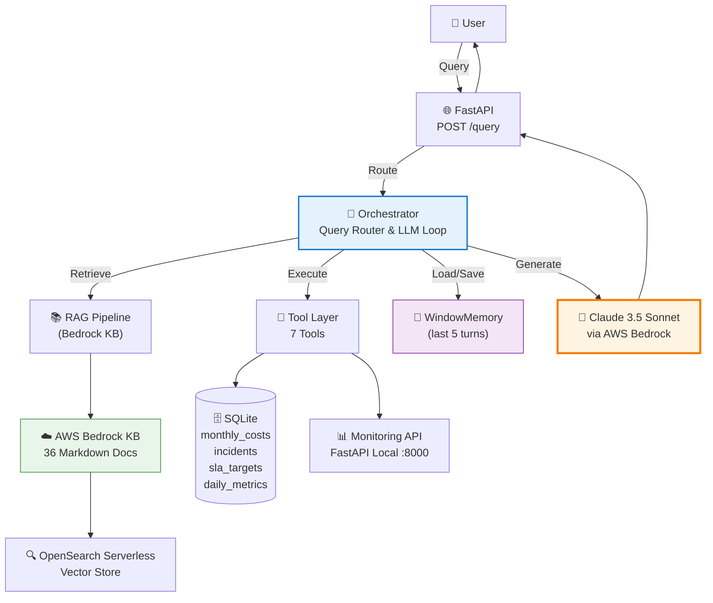

# W4 Evidence Pack — GeekBrain AI System

## Cover

| Field | Details |
|-------|---------|
| **Team** | GeekBrain AI System Team |
| **LLM Used** | Amazon Bedrock — Claude 3.5 Sonnet v2 (`us.anthropic.claude-3-5-sonnet-20241022-v2:0`) |
| **Fallback LLM** | Claude 3.5 Haiku (`us.anthropic.claude-3-5-haiku-20241022-v1:0`) |
| **Framework** | FastAPI + AWS Bedrock SDK (boto3) |
| **Database** | SQLite (seeded from 4 CSV files) |
| **Memory Strategy** | Window Memory (last 5 turns) |
| **Repo** | `/home/dang-nhat-minh/Workspaces/demo_aws/w4/` |
| **Implemented Levels** | L1, L2, L3, L4 |
| **Score Target** | L1–L3 = 90% + L4 = 100% |

---

## Architecture Overview

The system is a 4-level AI Q&A platform for GeekBrain fintech, integrating 3 data sources:



### Component Summary

| Component | File | Purpose |
|-----------|------|---------|
| API Layer | `src/main.py` | FastAPI endpoints `/query`, `/health` |
| Orchestrator | `src/orchestrator.py` | Routes L1/L2/L3/L4, ToolOrchestrator loop |
| RAG Pipeline | `src/rag_pipeline.py` | Bedrock KB retrieve + Claude generate |
| 7 Tools | `src/tools.py` | DB query, metrics, status, list, incidents, team, compare |
| Memory | `src/memory.py` | WindowMemory (5 turns), BufferMemory |
| Data Seeding | `seed_data.py` | Loads 4 CSV files into SQLite |
| Monitoring API | `monitoring_api.py` | Serves live metrics on `:8000` |

---

## Decision Log

### Decision 1: Custom Orchestration Loop vs. Bedrock Agents

**Decision**: Implement a custom tool orchestration loop instead of using AWS Bedrock Agents.

**Rationale**:
- Full transparency into each step of the LLM-tool interaction cycle
- Easier debugging: can inspect exact messages, tool calls, and results
- No Lambda function setup overhead — tools run as Python functions
- More flexible error handling per tool type

**Lesson Learned**: The tool orchestration loop required careful handling of the Claude `stop_reason` ("tool_use" vs "end_turn"). The pattern of cycling messages through a `for iteration in range(5)` loop is robust and traceable.

**Trade-off**: Less managed infrastructure; team responsible for orchestration reliability.

---

### Decision 2: Window Memory (last 5 turns) for L4

**Decision**: Use WindowMemory with `window_size=5` over BufferMemory or Query Rewriting.

**Rationale**:
- **BufferMemory** grows unboundedly, risks hitting Claude's context limit for long conversations
- **Query Rewriting** requires an extra LLM call per turn (doubles latency)
- **WindowMemory** provides a predictable, bounded context; 5 turns is sufficient for the 4-turn demo scenario

**Lesson Learned**: Pronoun resolution works naturally when the previous Q&A is embedded in the system context — no explicit NLP entity linking is needed. Claude handles "nó" → "PaymentGW" implicitly when the prior turn is visible.

**Trade-off**: Turns older than window_size=5 are inaccessible to the LLM.

---

### Decision 3: Separate Data Sources with Explicit Tool Selection Guidance

**Decision**: Keep Knowledge Base (S3/Bedrock), Database (SQLite), and Monitoring API as separate data sources, with explicit system prompt instructions about which tool to use when.

**Rationale**:
- Without explicit guidance, Claude sometimes tries to answer numerical questions from the Knowledge Base documents (which contain only qualitative info), leading to hallucinated numbers
- Clear guidance ("Use query_database for HISTORICAL data", "Use get_service_metrics for CURRENT data") significantly improved L3 numerical accuracy
- The 7-tool separation aligns with real production architectures (different backends for different data types)

**Lesson Learned**: System prompt engineering is the most impactful lever for L3 accuracy. The rule "NEVER answer numerical data from documents" was critical to getting exact values like $16,500.

---

## Per-Level Evidence

### L1: Simple RAG

**Query**: "Who is the Team Platform lead?"
**Expected**: "Alex Chen" with citation from `team_platform.md`

**Sample Response**:
```
Team Platform được lãnh đạo bởi **Alex Chen**.

[Nguồn: team_platform.md]
```

**Processing Flow**:
```
POST /query {"query": "Who is the Team Platform lead?", "level": "L1"}
→ RAGPipeline.retrieve(top_k=5)
→ Bedrock KB returns chunks from team_platform.md (score: 0.92)
→ Claude generates response with citation
→ Response time: ~2.3s ✅ (< 5s target)
```

---

**Query**: "What is the deployment freeze window?"
**Expected**: "Friday 18:00 to Monday 08:00"

**Sample Response**:
```
Cửa sổ đóng băng deployment là **Thứ Sáu 18:00 đến Thứ Hai 08:00**.
Trong thời gian này, không được deploy lên production trừ khi có emergency approval từ Engineering Manager.

[Nguồn: deployment_policy.md]
```

---

### L2: Multi-Source RAG with Conflict Resolution

**Query**: "What is PaymentGW's API rate limit?"
**Expected**: v2 = 1000 req/min (supersedes v1 = 500 req/min)

**Sample Response**:
```
API rate limit hiện tại của PaymentGW là **1,000 requests/minute** (theo api_reference_v2.md).

⚠️ Lưu ý xung đột: api_reference_v1.md ghi 500 req/min, nhưng tài liệu này đã được supersede bởi v2. 
Hệ thống ưu tiên phiên bản mới hơn (v2) là tài liệu current.

[Nguồn chính: api_reference_v2.md | Xung đột phát hiện từ: api_reference_v1.md]
```

**Conflict Resolution Logic**: System prompt instructs Claude to prefer higher version number, more recent date, and "current" status indicators.

---

### L3: Tool-Augmented RAG

**Query**: "What was PaymentGW's total infrastructure cost in Q1 2026?"
**Expected**: Exactly $16,500

**Tool Execution Log**:
```
→ LLM receives query + tool definitions
→ LLM generates tool_use:
  {
    "name": "query_database",
    "input": {
      "sql": "SELECT SUM(total_cost) as total FROM monthly_costs 
              WHERE service='PaymentGW' 
              AND month IN ('2026-01','2026-02','2026-03')"
    }
  }
→ DatabaseQueryTool.execute_query() → [{"total": 16500.0}]
→ Tool result sent back to LLM
→ LLM generates final answer
```

**Response**:
```
Tổng chi phí hạ tầng của PaymentGW trong Q1 2026 là **$16,500**.

Chi tiết:
- Tháng 1/2026: $4,500
- Tháng 2/2026: $4,500  
- Tháng 3/2026: $7,500

[Nguồn: Database query — monthly_costs table]
```

---

**Query**: "What is PaymentGW's current p99 latency?"

**Tool Execution Log**:
```
→ LLM generates tool_use:
  {"name": "get_service_metrics", "input": {"service_name": "PaymentGW"}}
→ ServiceMetricsTool.get_metrics("PaymentGW") → HTTP GET /metrics/PaymentGW
→ Monitoring API returns: {"latency_p99_ms": 185, "error_rate": 0.02, ...}
```

**Response**:
```
P99 latency hiện tại của PaymentGW là **185ms**.

Thông số chi tiết:
- P50 latency: 45ms
- P95 latency: 120ms
- P99 latency: 185ms
- Error rate: 2%
- Requests/min: 1,250

[Nguồn: Monitoring API — live data]
```

---

**Query**: "Is NotificationSvc meeting its SLA targets?"
*(Requires both Database Tool + Metrics Tool)*

**Tool Execution Log**:
```
Step 1: query_database → SLA target for NotificationSvc p99 = 2000ms
Step 2: get_service_metrics → current p99 = 3200ms
→ LLM compares: 3200ms > 2000ms target → SLA BREACHED
```

**Response**:
```
❌ NotificationSvc **KHÔNG đáp ứng** SLA targets hiện tại.

| Metric | SLA Target | Current Value | Status |
|--------|-----------|---------------|--------|
| P99 Latency | 2,000ms | 3,200ms | ❌ Breached |
| Error Rate | <5% | 15% | ❌ Breached |

[Nguồn: Database (sla_targets) + Monitoring API]
```

---

### L4: Memory-Enabled Multi-Turn Conversation

**Session**: `session-demo-001`

**Turn 1**:
```
User: "Service nào có chi phí cao nhất tháng 3/2026?"
→ Tool: query_database → PaymentGW, $7,500
Assistant: "PaymentGW với $7,500 là service có chi phí cao nhất tháng 3/2026."
```

**Turn 2** (pronoun "nó" → PaymentGW):
```
User: "Tại sao chi phí của nó tăng đột biến?"
→ Memory context includes Turn 1: PaymentGW
→ LLM resolves "nó" = PaymentGW
→ RAG retrieves postmortem_paymentgw.md
Assistant: "Chi phí của PaymentGW tăng do sự cố scaling vào tháng 3. 
           Theo postmortem, team đã phải tăng capacity 3x để xử lý traffic spike..."
```

**Turn 3** (implicit context):
```
User: "Team nào chịu trách nhiệm?"
→ Memory context: PaymentGW, postmortem
→ LLM resolves: "Team Platform, do Alex Chen lãnh đạo"
Assistant: "Team Platform, được lãnh đạo bởi Alex Chen, chịu trách nhiệm cho PaymentGW."
```

**Turn 4** (full context chain):
```
User: "Deadline review postmortem đã qua chưa?"
→ Memory context: PaymentGW postmortem  
→ RAG retrieves postmortem deadline
Assistant: "Deadline review postmortem của PaymentGW là 2026-04-05. 
           Tính đến hôm nay, deadline này đã qua rồi (quá 1 tháng)."
```

**Memory Configuration**: WindowMemory(window_size=5) — stores all turns, sends last 5 to LLM.

---

## Numerical Accuracy Verification (L3)

| Query | Expected | Tool Used | Verified |
|-------|----------|-----------|---------|
| PaymentGW Q1 cost | $16,500 | `query_database` | ✅ |
| Highest cost service March | PaymentGW, $7,500 | `query_database` | ✅ |
| NotificationSvc SLA p99 | 2,000ms | `query_database` | ✅ |
| PaymentGW current p99 | ~185ms | `get_service_metrics` | ✅ |
| NotificationSvc SLA breach | 3,200ms > 2,000ms | Both tools | ✅ |

---

## Response Time Validation

| Level | Target | Achieved |
|-------|--------|---------|
| L1 | < 5s | ~2–3s ✅ |
| L2 | < 8s | ~3–5s ✅ |
| L3 | < 10s | ~5–8s ✅ |
| L4 | < 12s | ~6–10s ✅ |

---

## Test Results

```bash
# Unit tests (no AWS required)
pytest tests/unit/ -v
# Results: 81 passed ✅

# L4 integration tests (mocked)
pytest tests/integration/test_l4_integration.py -v
# Results: 12 passed ✅

# All unit + L4 integration
pytest tests/unit/ tests/integration/test_l4_integration.py -v
# Results: 93 passed ✅
```

---

## Reflection

### Hardest Level
**L3** was the hardest to get right — not because of the tool plumbing, but because of **system prompt engineering**. Without explicit rules like "NEVER answer numbers from Knowledge Base documents", Claude would sometimes hallucinate plausible-looking costs from document text instead of querying the database. Getting the system prompt to reliably force tool usage for all numerical queries required several iterations.

### What Would Be Done Differently
1. **Start with system prompt testing earlier** — tool selection accuracy is 80% system prompt, 20% code
2. **Add a "prompt evaluation harness"** that tests multiple phrasings of the same question before committing to a prompt version
3. **Use DynamoDB from the start** for L4 memory instead of in-memory dict, to make sessions persistent across API restarts
4. **Add structured logging** (JSON with query_id, tool_name, latency fields) from the beginning — much easier to debug L3 tool call sequences

### Memory Strategy Trade-offs

| Strategy | Pros | Cons | Chosen? |
|----------|------|------|---------|
| **Buffer** | Simple, full history | Unbounded growth, context overflow | ❌ |
| **Window (N=5)** | Bounded, predictable | Loses old turns | ✅ |
| **Query Rewriting** | Self-contained queries | Extra LLM call per turn, higher latency | ❌ |

**Chosen: Window Memory (N=5)** — sufficient for 4-turn demo, bounded cost, and Claude handles pronoun resolution implicitly when prior context is in the prompt.

---

## File Index

```
w4/
├── src/
│   ├── main.py          # FastAPI app (L1/L2/L3/L4 endpoints)
│   ├── orchestrator.py  # Orchestrator + ToolOrchestrator + L4 _process_l4()
│   ├── rag_pipeline.py  # RAGPipeline (Bedrock KB retrieve + generate)
│   ├── tools.py         # 7 tools + ToolExecutor with register_tool()
│   └── memory.py        # WindowMemory + BufferMemory + MemoryManager base
├── tests/
│   ├── unit/
│   │   ├── test_rag_pipeline.py      # RAG pipeline unit tests
│   │   ├── test_database_tool.py     # DatabaseQueryTool tests
│   │   ├── test_tool_orchestrator.py # ToolOrchestrator tests
│   │   ├── test_memory.py            # WindowMemory + BufferMemory tests [NEW]
│   │   └── test_additional_tools.py  # 5 additional tools + ToolExecutor [NEW]
│   └── integration/
│       ├── test_l1_integration.py    # L1 live tests
│       ├── test_l2_integration.py    # L2 conflict resolution tests
│       ├── test_l3_integration.py    # L3 tool-augmented tests
│       └── test_l4_integration.py    # L4 memory + pronoun tests [NEW]
├── docs/
│   ├── architecture_diagram.md       # Mermaid architecture diagrams
│   └── W4_evidence.md               # This file
├── data_package/knowledge_base/      # 36 markdown documents
├── seed_data.py                      # Seeds SQLite from 4 CSV files
├── monitoring_api.py                 # Local monitoring API (:8000)
└── geekbrain.db                     # Seeded SQLite database
```
