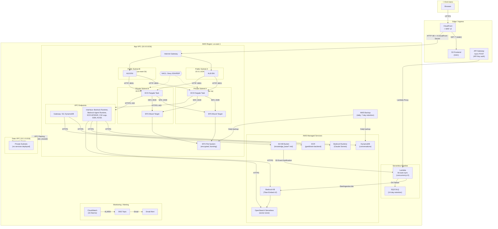

# W5 Architecture Review — Senior Solution Architect Report

**Reviewer:** Senior Solution Architect (automated review)
**Date:** 2026-05-15
**Project:** GeekBrain — Unified ReAct Agent for Platform Engineering
**Group:** GROUP 5 — XBrain (Minh, Quyen, Thuy)
**Repository:** https://github.com/me-dangnhatminh/demo_aws

---

## Table of Contents

1. [Step 1 — Project Inventory](#step-1--project-inventory)
2. [Step 2 — Evidence Document & Diagram Analysis](#step-2--evidence-document--diagram-analysis)
3. [Step 3 — Source Code Analysis](#step-3--source-code-analysis)
4. [Step 4 — Infrastructure / IaC Analysis](#step-4--infrastructure--iac-analysis)
5. [Step 5 — Cross-Reference: Diagram vs Reality](#step-5--cross-reference-diagram-vs-reality)
6. [Step 6 — Industry Standards Assessment](#step-6--industry-standards-assessment)
7. [Step 7 — Diagram Issues: Specific Findings](#step-7--diagram-issues-specific-findings)
8. [Step 8 — Redesigned Architecture](#step-8--redesigned-architecture)
9. [Step 9 — Final Scorecard](#step-9--final-scorecard)

---

## Step 1 — Project Inventory

### Full File Tree (excluding node_modules, __pycache__, dist)

```
w5/
├── AGENT.md
├── team_platform.md
├── .gitignore
│
├── backend/
│   ├── Dockerfile
│   ├── .dockerignore
│   ├── .env                          ← REAL credentials committed
│   ├── .env.example                  ← Identical to .env (not placeholders)
│   ├── requirements.txt
│   ├── pytest.ini
│   ├── start_backend.sh
│   ├── kb_sync.py
│   ├── monitoring_api.py
│   ├── seed_data.py
│   ├── geekbrain.db                  ← SQLite database (binary)
│   ├── src/
│   │   ├── main.py
│   │   ├── orchestrator.py
│   │   ├── tools.py
│   │   ├── rag_pipeline.py
│   │   ├── memory.py
│   │   ├── investigation.py
│   │   └── event_logger.py
│   ├── lambda/
│   │   ├── kb_auto_sync_lambda.py
│   │   └── kb_auto_sync_lambda.zip
│   ├── tests/
│   │   ├── unit/ (6 test files)
│   │   ├── integration/ (6 test files)
│   │   └── test_service_metrics_tool.py
│   └── data_package/
│       ├── knowledge_base/ (30+ .md files)
│       ├── structured_data/ (4 .csv files)
│       └── scripts/ (monitoring_api.py, seed_data.py)
│
├── frontend/
│   ├── index.html
│   ├── package.json
│   ├── package-lock.json
│   ├── vite.config.js
│   ├── .env.example
│   └── src/
│       ├── main.jsx
│       ├── App.jsx
│       ├── index.css
│       ├── styles.css                ← Dead code (legacy CSS)
│       ├── lib/utils.js
│       └── components/
│           ├── Header.jsx
│           ├── ChatInput.jsx
│           ├── ChatMessage.jsx
│           └── Sidebar.jsx
│
├── terraform/
│   ├── main.tf
│   ├── variables.tf
│   ├── networking.tf
│   ├── ecs.tf
│   ├── efs.tf
│   ├── storage.tf
│   ├── bedrock_kb.tf
│   ├── api_gateway.tf
│   ├── lambda.tf
│   ├── cloudfront.tf
│   ├── waf.tf
│   ├── backup.tf
│   ├── monitoring.tf
│   ├── outputs.tf
│   ├── userdata.sh                   ← Dead code (legacy EC2 script)
│   ├── .gitignore
│   ├── .terraform.lock.hcl
│   ├── terraform.tfstate             ← LOCAL state (no remote backend)
│   ├── terraform.tfstate.backup (x7)
│   └── scripts/create_oss_index.py
│
├── scripts/
│   ├── deploy.sh
│   └── destroy.sh
│
└── docs/
    ├── W5_evidence.md
    ├── architecture_diagram.drawio
    ├── architecture_diagram.drawio.png
    └── screenshots/ (29 .png files)
```

### File Category Summary

| Category | Count | Notes |
|---|---|---|
| Terraform IaC (`.tf`) | 14 | All flat root module, no child modules |
| Backend Python source | 7 | FastAPI + boto3 + Bedrock |
| Backend Python tests | 13 | Unit + integration + standalone |
| Frontend JSX/JS source | 8 | React + Vite + Tailwind CSS v4 |
| Lambda function | 1 | Python 3.11, KB auto-sync |
| Documentation | 1 evidence doc + 30+ KB docs | |
| Images/Screenshots | 29 screenshots + 1 architecture diagram | |
| Config files | Dockerfile, docker-compose (none), .env, requirements.txt, package.json, vite.config.js | |
| Scripts | deploy.sh, destroy.sh, start_backend.sh, kb_sync.py, seed_data.py | |
| Dead code | userdata.sh (EC2 legacy), styles.css (legacy CSS) | |

---

## Step 2 — Evidence Document & Diagram Analysis

### 2.1 Evidence Document — Stated Architecture & Goals

**Application:** GeekBrain — a Unified ReAct Agent with RAG, tools, and memory for platform engineering observability.

**Claimed Stack:** ECS Fargate + CloudFront + ALB + Bedrock KB + DynamoDB + EFS

**Key Architectural Goals:**
1. **Multi-VPC isolation:** App VPC (10.0.0.0/16) for compute, Data VPC (10.1.0.0/16) for storage (EFS), connected via VPC Peering
2. **Zero internet egress:** No NAT Gateway; all AWS service access through 9 VPC Endpoints
3. **Edge security:** WAF v2 on CloudFront with 3 managed rule sets + custom rate limiting
4. **Serverless scaling pattern:** Lambda with reserved concurrency, DLQ, and S3 event trigger
5. **API Gateway authentication:** REST API with API Key + usage plan throttling
6. **Backup/DR strategy:** AWS Backup for EFS + DynamoDB, daily at 05:00 UTC, 7-day retention

### Milestones Covered

| Milestone | Topic | Key Claims |
|---|---|---|
| MH1 | Multi-VPC Connectivity | VPC Peering (pcx-0ab397fc68fd601a0), bidirectional routes, VPC Flow Logs |
| MH2 | Network Security Hardening | 9 VPC Endpoints, 4 Security Groups, custom NACL (SSH/RDP deny) |
| MH3 | File Storage + Backup | EFS encrypted (KMS), 2 AZ mount targets, AWS Backup daily, restore test |
| MH4 | API Gateway + Auth + Throttling | REST API /sync POST, API Key required, usage plan (10/s, burst 20, 1000/day) |
| MH5 | Serverless Scaling | Lambda reserved concurrency=2, SQS DLQ, S3 event trigger, throttle test |
| Bonus | WAF v2, 10 CloudWatch alarms, 14 .tf files, negative security tests |

### Verifiable Claims (to check against IaC in Step 5)

1. VPC CIDRs: app=10.0.0.0/16, data=10.1.0.0/16
2. 9 specific VPC Endpoints (2 Gateway + 7 Interface)
3. 4 Security Groups with least-privilege rules
4. NACL rules 50/51/100 on private subnets
5. EFS encrypted with KMS, mount targets in Data VPC (claimed)
6. Backup plan: daily, 05:00 UTC, 7-day retention
7. API Gateway: /sync POST, API Key required
8. Lambda: reserved concurrency=2, DLQ on failure
9. WAF: 3 managed rule sets + rate limit 2000/5min
10. 10 CloudWatch alarms

---

### 2.2 Architecture Diagram Analysis

**File:** `w5/docs/architecture_diagram.drawio.png`

#### Components Visible (top to bottom)

| Layer | Components |
|---|---|
| Users | People icon at top |
| Region boundary | Large teal rectangle enclosing everything |
| Edge | WAF (shield icon) → CloudFront → S3 Frontend (OAC) |
| App VPC | Public Subnet (ALB), Private Subnets in 2 AZs (ECS Fargate tasks in SG boundaries), VPC Endpoint icon |
| AWS Services panel | Bedrock, CloudWatch Logs, DynamoDB, S3 KB, ECR, Lambda kb_auto_sync, AWS Backup |
| VPC Peering | Bidirectional arrow between App VPC and Data VPC |
| Data VPC | EFS (single icon) |

#### Arrow / Flow Trace

1. Users → CloudFront (implied)
2. WAF → CloudFront (inspection before delivery)
3. CloudFront → S3 Frontend (static assets via OAC)
4. CloudFront → ALB (API traffic, public subnet)
5. ALB → ECS Tasks in AZ1 and AZ2 (private subnets)
6. ECS Tasks → VPC Endpoint → AWS Services (Bedrock, CW Logs, DynamoDB, S3, ECR, Lambda, Backup)
7. App VPC ↔ Data VPC (VPC Peering, bidirectional)
8. ECS Tasks → EFS (via peering, implied)

#### Diagram Omissions and Ambiguities

- **API Gateway is completely absent** — MH4 is a major milestone about API Gateway, but it does not appear in the diagram
- **SQS DLQ is not shown** — critical component of MH5
- **S3 event trigger flow is not drawn** — the S3 → Lambda notification path is missing
- **Internet Gateway is not drawn** in the App VPC (must exist for ALB)
- **ALB shown as single block** in one "Public Subnet" — should show 2 subnets across 2 AZs
- **NACL not visually represented** anywhere
- **Individual VPC Endpoints not enumerated** — shown as a single generic icon
- **No legend** for custom elements
- **No arrow labels** (flows are implied, not annotated)
- **SNS / CloudWatch Alarms** not depicted

---

### 2.3 Screenshot Analysis Summary

#### MH1 — Multi-VPC Connectivity (4 screenshots)

| Screenshot | Shows | Confirms |
|---|---|---|
| mh1_vpcs.png | VPC Console: 2 VPCs (app 10.0.0.0/16, data 10.1.0.0/16) | VPC CIDRs match claims |
| mh1_peering.png | Peering connection pcx-0ab397fc68fd601a0, Active, 3 route tables | Peering ID and status match |
| mh1_route_data.png | Route table for app-private-rt with 10.1.0.0/16 → peering | Cross-VPC route configured |
| mh1_flow_logs.png | Flow log entries showing ACCEPT traffic | **ISSUE:** Shows public IPs → 10.0.2.188, NOT cross-VPC peering traffic (10.0.x ↔ 10.1.x). Does not prove peering data flow. |

#### MH2 — Network Security (4 screenshots)

| Screenshot | Shows | Confirms |
|---|---|---|
| mh2_vpc_endpoints.png | 9 endpoints, all Available, correct types | Matches claims exactly |
| mh2_security_groups.png | 6 SGs listed | **ISSUE:** 6 SGs exist (2 are legacy from old VPC vpc-08ae5...), doc claims only 4 |
| mh2_sg_inbound.png | EFS SG: NFS 2049 from 10.0.11.0/24 and 10.0.12.0/24 only | Least-privilege confirmed |
| mh2_nacl_deny.png | NACL rules 50 DENY SSH, 51 DENY RDP, 100 ALLOW ALL | Matches claims exactly |

#### MH3 — File Storage + Backup (8 screenshots)

| Screenshot | Shows | Confirms |
|---|---|---|
| mh3_efs.png | EFS fs-03c20cc74b2ac8c36, encrypted, General Purpose | Matches claims |
| mh3_mount_targets.png | 2 mount targets in us-east-1a/1b | **CRITICAL:** Mount targets are in VPC vpc-0064bfc... (APP VPC), NOT Data VPC. IPs 10.0.11.225 and 10.0.12.139 are in 10.0.x.x range. Doc falsely claims "Data VPC." |
| mh3_ecs_volumes.png | Task def with 2 EFS volumes, transit encryption on | Matches claims |
| mh3_file_read.png | CloudWatch logs showing file reads | EFS access working |
| mh3_backup_plan.png | Backup plan: daily 05:00 UTC, 7-day retention | Matches claims exactly |
| mh3_recovery_points.png | Recovery points in vault | Backup is running |
| mh3_restore_completed.png | Restore job COMPLETED for fs-04df677d6a344acbb | Restore verified |
| mh3_restore_data.png | Restored EFS: encrypted, 6144 bytes, available | Restore verified |

#### MH4 — API Gateway (4 screenshots)

| Screenshot | Shows | Confirms |
|---|---|---|
| mh4_resources.png | API Gateway /sync POST, API Key required, Lambda proxy | Matches claims |
| mh4_usage_plan.png | Rate 10/s, Burst 20, Quota 1000/day | Matches claims exactly |
| mh4_test_403.png | curl without API key → HTTP 403 | Auth working |
| mh4_test_200.png | curl with API key → HTTP 200, ingestion_job_id returned | **SECURITY:** Full API key visible: `z1iWIbkB805MoV8Hs14PYQq8Aan1SYXHSRYjvnEc` |

#### MH5 — Serverless Scaling (5 screenshots)

| Screenshot | Shows | Confirms |
|---|---|---|
| mh5_concurrency.png | Lambda reserved concurrency=2, triggers: API GW + S3, dest: SQS | Matches claims |
| mh5_destinations.png | On-failure → SQS geekbrain-kb-sync-dlq | Matches claims |
| mh5_throttles-1.png | 5 files uploaded concurrently to S3 | Test setup confirmed |
| mh5_throttles-2.png | CloudWatch Throttles metric Sum=2.0 | Concurrency cap hit |
| mh5_dlq_message.png | 11 messages in DLQ, message detail shown | DLQ working |

#### Application + Negative Tests (3 screenshots)

| Screenshot | Shows | Confirms |
|---|---|---|
| app_e2e.png | GeekBrain UI: multi-step ReAct with tool use | App functional |
| app_dynamodb.png | DynamoDB: 50 items, proper schema with TTL | Persistence working |
| neg_alb_direct.png | curl to ALB → connection timeout after 10s | SG blocks direct access |

---

## Step 3 — Source Code Analysis

### 3.1 Backend Architecture

| File | Purpose | Key Dependencies |
|---|---|---|
| `src/main.py` | FastAPI app: `/health`, `/query`, `/query/stream`, `/investigate`, observability endpoints | FastAPI, uvicorn, all other modules |
| `src/orchestrator.py` | Unified ReAct agent loop: LLM → tool → LLM iteration | boto3 bedrock-runtime |
| `src/tools.py` | 8 tools: KB retrieval, DB query, metrics, status, services, incidents, teams, comparison | sqlite3, requests, RAGPipeline |
| `src/rag_pipeline.py` | Bedrock Knowledge Base retrieval + grounded generation | boto3 bedrock-agent-runtime |
| `src/memory.py` | Conversation memory: Buffer, Window, DynamoDB strategies | boto3 dynamodb |
| `src/investigation.py` | Multi-step investigation agent (plan-gather-analyze-report) | ToolExecutor, Orchestrator |
| `src/event_logger.py` | In-memory query event tracking for observability UI | None (pure Python) |
| `monitoring_api.py` | Mock monitoring API (hardcoded data + 5% jitter) | FastAPI |
| `lambda/kb_auto_sync_lambda.py` | S3 event → Bedrock KB re-ingestion | boto3 bedrock-agent |

### 3.2 Critical Code Findings

#### Security Issues

| Severity | File | Issue |
|---|---|---|
| **CRITICAL** | `.env` | Real AWS resource IDs committed to git. `.env.example` is identical (not placeholders). |
| **CRITICAL** | `src/tools.py` | **SQL injection in DatabaseQueryTool**: LLM-generated SQL executed with only keyword-based blocklist. Subqueries, `PRAGMA`, `ATTACH DATABASE`, `load_extension()` can bypass it. |
| **HIGH** | `src/main.py` | CORS `allow_origins=["*"]` with `allow_credentials=True`. Permits any origin. |
| **HIGH** | `src/main.py` | No authentication/authorization on any endpoint. Anyone can query the AI agent. |
| **HIGH** | `Dockerfile` | Runs as root — no `USER` directive. |
| **HIGH** | `src/investigation.py` | SQL injection via f-string: `f"SELECT * FROM sla_targets WHERE service='{service_name}'"` |
| **MEDIUM** | `src/event_logger.py` | Observability endpoints expose all queries without auth — information disclosure. |
| **MEDIUM** | `src/orchestrator.py` | Tool results fed back to LLM without sanitization — prompt injection vector. |
| **MEDIUM** | Frontend `Header.jsx` | API key embedded in client-side JS bundle via `VITE_API_KEY`. |
| **MEDIUM** | Frontend `Header.jsx` | Hardcoded production API Gateway URL as fallback: `https://wgxe9ot493.execute-api.us-east-1.amazonaws.com/prod` |

#### Architectural Issues

| Severity | File | Issue |
|---|---|---|
| **HIGH** | `Dockerfile` | Two processes in one container (`monitoring_api.py &` + `main.py`). No process supervisor. If monitoring API crashes, main app continues without it. |
| **HIGH** | `.env` | Region mismatch: `AWS_REGION=ap-southeast-1` but `DYNAMODB_REGION=us-east-1`. Cross-region latency for Bedrock calls. |
| **MEDIUM** | `src/main.py` | Module-level initialization with side effects — prints, HTTP checks, DB queries at import time. |
| **MEDIUM** | `src/memory.py` | `BufferMemory` has unbounded growth — no eviction, no size limit. Memory leak risk. |
| **MEDIUM** | `src/memory.py` | `DynamoDBMemory.get_history` queries ALL items then slices in Python. Should use `Limit` parameter. |
| **MEDIUM** | `src/orchestrator.py` | No retry logic for Bedrock API calls. Single transient failure kills the request. |
| **MEDIUM** | `requirements.txt` | `sqlalchemy` listed but never imported. Test deps (`pytest`, `pytest-mock`) mixed with production deps. |
| **LOW** | `src/main.py` | Print statements with emoji instead of Python `logging` module throughout. |
| **LOW** | `start_backend.sh` | References "w4" in error message — stale from previous week. |
| **LOW** | `src/investigation.py` | Service name mismatch: lists `UserProfileSvc`, `TransactionSvc` but monitoring API has `OrderSvc`, `FraudDetector`. |

### 3.3 Frontend Analysis

| File | Purpose | Key Concern |
|---|---|---|
| `App.jsx` | Core SPA: state management, SSE streaming, localStorage sessions | No auth, no error boundaries, no JSON.parse error handling for SSE |
| `Header.jsx` | Nav bar with health indicator and KB sync button | Hardcoded API Gateway URL + API key in bundle |
| `ChatInput.jsx` | Text input with auto-resize | No max-length on input |
| `ChatMessage.jsx` | Message renderer with ReAct reasoning trace | Safe (no dangerouslySetInnerHTML) |
| `Sidebar.jsx` | Session list with delete | Delete button is `<span>` not `<button>` — accessibility issue |
| `styles.css` | Legacy CSS from prior UI iteration | **Dead code** — none of these classes are referenced |
| `package.json` | Named `geekbrain-w4-frontend` (wrong week) | `react-markdown` declared but never used. Unpinned "latest" versions. |

---

## Step 4 — Infrastructure / IaC Analysis

### 4.1 Terraform State & Configuration

| Aspect | Status | Detail |
|---|---|---|
| Provider | AWS ~> 5.0 (locked at 5.100.0) | Also `hashicorp/null` 3.3.0, `hashicorp/archive` 2.8.0 |
| Required TF version | >= 1.0 | |
| **State backend** | **LOCAL** | No remote backend, no locking, no encryption. 7 backup copies on disk. State contains secrets in plaintext. |
| Modules | **None** | All 14 .tf files are flat root module. No DRY abstraction. |
| tfvars files | **None** | Zero `.tfvars` files. All config via variable defaults. No multi-environment separation. |
| Total resources | ~60+ AWS resources | |

### 4.2 Complete Resource Topology (from IaC)

#### Networking

| Resource | Detail |
|---|---|
| **App VPC** | 10.0.0.0/16, DNS support + hostnames enabled |
| **Data VPC** | 10.1.0.0/16, DNS support + hostnames enabled |
| App public subnet A | 10.0.1.0/24, us-east-1a (ALB) |
| App public subnet B | 10.0.2.0/24, us-east-1b (ALB) |
| App private subnet A | 10.0.11.0/24, us-east-1a (ECS, EFS, VPC endpoints) |
| App private subnet B | 10.0.12.0/24, us-east-1b (ECS, EFS, VPC endpoints) |
| Data private subnet A | 10.1.1.0/24, us-east-1a (**empty — no services deployed**) |
| Data private subnet B | 10.1.2.0/24, us-east-1b (**empty — no services deployed**) |
| Internet Gateway | App VPC only |
| NAT Gateway | **None** (zero egress by design) |
| VPC Peering | App ↔ Data, auto-accept, routes configured both ways |
| VPC Flow Logs | Both VPCs → CloudWatch Logs (7-day retention) |

#### VPC Endpoints (9)

| Endpoint | Type | Location |
|---|---|---|
| S3 | Gateway | App private route tables |
| DynamoDB | Gateway | App private route tables |
| Bedrock Runtime | Interface | App private subnets (both AZs) |
| Bedrock Agent Runtime | Interface | App private subnets (both AZs) |
| CloudWatch Logs | Interface | App private subnets (both AZs) |
| ECR API | Interface | App private subnets (both AZs) |
| ECR DKR | Interface | App private subnets (both AZs) |
| SSM | Interface | App private subnets (both AZs) |
| OpenSearch Serverless | Interface | App private subnet B **only** |

#### Security Groups

| SG | VPC | Ingress | Egress |
|---|---|---|---|
| `alb-sg` | App | TCP 80 from CloudFront managed prefix list | TCP 8001 to private CIDRs |
| `ecs-task-sg` | App | TCP 8001 from ALB SG | TCP 443 to VPCE SG + S3/DynamoDB prefix lists; TCP 2049 to private CIDRs; TCP 8000 self |
| `vpce-sg` | App | TCP 443 from private CIDRs | Default deny |
| `efs-sg` | App | TCP 2049 from 10.0.11.0/24, 10.0.12.0/24 | Default deny |

All SGs follow least-privilege. No 0.0.0.0/0 ingress anywhere.

#### NACL (App Private Subnets)

| Rule | Protocol | Port | Source | Action |
|---|---|---|---|---|
| 50 | TCP | 22 (SSH) | 0.0.0.0/0 | DENY |
| 51 | TCP | 3389 (RDP) | 0.0.0.0/0 | DENY |
| 100 | All | All | 0.0.0.0/0 | ALLOW |
| * | All | All | 0.0.0.0/0 | DENY (default) |

#### Compute (ECS)

| Resource | Detail |
|---|---|
| ECR Repository | `geekbrain-backend`, MUTABLE tags, force_delete=true |
| ECS Cluster | `geekbrain` |
| Task Definition | Fargate, 0.5 vCPU / 1024 MB, 2 EFS volumes (transit encryption), secrets from SSM |
| ECS Service | Desired count=2, private subnets (both AZs), no public IP |
| ALB | Internet-facing, HTTP only (port 80), `X-CloudFront-Secret` header validation |

#### Storage

| Resource | Detail |
|---|---|
| EFS | Encrypted (KMS), General Purpose, Bursting, mount targets in **App VPC** private subnets |
| EFS Access Point | `/database` path, POSIX user 1000:1000 |
| DynamoDB | `geekbrain-conversations`, PAY_PER_REQUEST, TTL on `expires_at` |
| S3 KB bucket | `geekbrain-kb-dev`, versioning enabled, SSE AES256, fully private |
| S3 Frontend bucket | `geekbrain-frontend-dev`, OAC-only access, **no SSE configured** |

#### Edge / CDN

| Resource | Detail |
|---|---|
| CloudFront | Default certificate (no custom domain), WAF attached |
| WAF v2 | 3 managed rules (CRS, SQLi, KnownBadInputs) + rate limit 2000/5min |
| Origins | S3 frontend (OAC, SigV4) + ALB backend (HTTP-only, secret header) |

#### Serverless

| Resource | Detail |
|---|---|
| Lambda | `geekbrain-kb-auto-sync-dev`, Python 3.11, timeout 60s, reserved concurrency=2 |
| SQS DLQ | `geekbrain-kb-sync-dlq`, 14-day retention, SQS-managed SSE |
| API Gateway | REST API, /sync POST, API Key required, usage plan (10/s, burst 20, 1000/day) |

#### AI / ML

| Resource | Detail |
|---|---|
| OpenSearch Serverless | `geekbrain-kb`, VECTORSEARCH, **AllowFromPublic=true** |
| Bedrock Knowledge Base | Titan Embed Text v2, S3 source, OpenSearch storage |
| Embedding model | `amazon.titan-embed-text-v2:0` (1024 dimensions) |

#### Backup

| Resource | Detail |
|---|---|
| Backup Plan | Daily 05:00 UTC, 7-day retention |
| Backed up resources | EFS + DynamoDB (comment says 3 but only 2 selected) |

#### Monitoring

| Resource | Detail |
|---|---|
| SNS Topic | `geekbrain-alerts`, email subscription to `admin@example.com` (placeholder) |
| CloudWatch Alarms | 10 alarms (ECS CPU/Mem/Tasks, ALB 5xx/Latency/Unhealthy, DDB throttle, Lambda errors, WAF blocked, DLQ messages) |

#### IAM Roles

| Role | Trust | Key Permissions |
|---|---|---|
| `ecs-execution` | ECS Tasks | ECR pull, CW Logs, SSM GetParameters for `/geekbrain/*` |
| `ecs-task` | ECS Tasks | Bedrock InvokeModel (**wildcard region**), Bedrock Retrieve (scoped), DynamoDB CRUD (scoped), S3 read (scoped), EFS mount+write (scoped) |
| `bedrock-kb` | Bedrock | Bedrock InvokeModel (embedding), AOSS APIAccessAll (**overly broad**), S3 read (scoped) |
| `lambda-execution` | Lambda | CW Logs basic, Bedrock ingestion (scoped), S3 read (scoped), SQS SendMessage (scoped) |
| `flow-logs` | VPC Flow Logs | CW Logs create+put (scoped to 2 log groups) |
| `backup` | Backup | AWS managed backup/restore policies |

### 4.3 Encryption Assessment

| Resource | At Rest | In Transit |
|---|---|---|
| EFS | ✅ KMS encrypted | ✅ Transit encryption enabled |
| DynamoDB | ⚠️ AWS-owned CMK (default) | ✅ HTTPS via VPC endpoint |
| S3 KB bucket | ✅ AES256 SSE | ✅ HTTPS via VPC endpoint |
| S3 Frontend bucket | ❌ **No SSE configured** | ✅ HTTPS via CloudFront OAC |
| OpenSearch Serverless | ✅ AWS-owned key | ✅ HTTPS |
| SQS DLQ | ✅ SQS-managed SSE | ✅ HTTPS |
| **CloudFront → ALB** | N/A | ❌ **HTTP only — unencrypted** |
| CloudFront → Users | N/A | ✅ HTTPS (redirect-to-https) |
| SSM Parameters | ⚠️ Type `String` (not `SecureString`) | ✅ HTTPS via VPC endpoint |

---

## Step 5 — Cross-Reference: Diagram vs Reality

### Q1: What components are in the diagram but MISSING from code/IaC?

| Diagram Component | Status in IaC | Verdict |
|---|---|---|
| EFS in Data VPC | EFS mount targets are in **App VPC** (10.0.11.0/24, 10.0.12.0/24 per IaC `efs.tf`). The Data VPC has zero deployed resources. | ❌ **INACCURATE** — EFS is shown in the wrong VPC |
| All other shown components | Present in IaC | ✅ |

### Q2: What components are in code/IaC but MISSING from the diagram?

| Component in IaC | In Diagram? | Impact |
|---|---|---|
| **API Gateway** (geekbrain-sync-api) | ❌ Missing | Major — entire MH4 milestone not shown |
| **SQS DLQ** (geekbrain-kb-sync-dlq) | ❌ Missing | Major — MH5 failure handling not shown |
| **S3 event notification** (S3 → Lambda trigger) | ❌ Missing | Major — MH5 automation not shown |
| **Internet Gateway** | ❌ Missing | Moderate — required for ALB to work |
| **OpenSearch Serverless** collection | ❌ Missing | Moderate — the vector store for Bedrock KB |
| **SNS Topic** + CloudWatch Alarms | ❌ Missing | Moderate — monitoring plane absent |
| **SSM Parameter Store** | ❌ Missing | Minor — config/secrets management |
| **ECR Repository** | Shown in AWS Services panel | ✅ |
| **AWS Backup** | Shown in AWS Services panel | ✅ |

### Q3: Are the data flow directions correct?

| Flow | Correct? | Detail |
|---|---|---|
| Users → CloudFront | ✅ | Implied but correct |
| WAF → CloudFront | ⚠️ | Arrow direction is debatable — WAF is attached to CloudFront, not a separate hop |
| CloudFront → S3 Frontend | ✅ | OAC access |
| CloudFront → ALB | ✅ | API proxy |
| ALB → ECS Tasks | ✅ | Load-balanced |
| ECS → VPC Endpoints → AWS Services | ✅ | Correct for Bedrock, DynamoDB, S3, ECR, CW Logs |
| App VPC ↔ Data VPC (peering) | ❌ | **VPC Peering exists but Data VPC is empty. EFS is in App VPC. The peering flow shown (for EFS access) is misleading.** |

### Q4: Are security and network boundaries accurately represented?

| Boundary | Accurate? | Detail |
|---|---|---|
| Region boundary | ✅ | Correctly shown |
| App VPC boundary | ✅ | Correctly drawn |
| Data VPC boundary | ❌ | **Shows EFS inside Data VPC, but EFS mount targets are in App VPC** |
| Public subnet | ⚠️ | Shown as single block rather than 2 subnets across 2 AZs |
| Private subnets | ✅ | Shown in 2 AZs |
| Security group around ECS tasks | ✅ | Correctly drawn per AZ |
| NACL | ❌ | Not shown at all |
| ALB SG | ❌ | Not explicitly drawn |
| VPCE SG | ❌ | Not explicitly drawn |

### Q5: Does the diagram show the correct relationships between services?

**Mostly yes, but with significant omissions:**
- The core data flow (Users → CloudFront → ALB → ECS → AWS Services) is correct
- The KB sync pipeline (API Gateway → Lambda → Bedrock ingestion, S3 → Lambda trigger) is **completely absent**
- The monitoring plane (CloudWatch Alarms → SNS) is absent
- The EFS placement is wrong (shown in Data VPC, actually in App VPC)

---

## Step 6 — Industry Standards Assessment

### Architecture

| Standard | Status | Rationale |
|---|---|---|
| Follows Well-Architected principles | ⚠️ Partial | Good: multi-AZ, VPC isolation, encryption, backup. Poor: HTTP between CloudFront/ALB, local TF state, no auth on backend. |
| No single points of failure (SPOF) | ⚠️ Partial | ECS: 2 tasks across 2 AZs (good). ALB: multi-AZ (good). But: single EFS file system, single DynamoDB table (both regionally resilient but no cross-region DR), local TF state is a SPOF for operations. |
| Services appropriately decomposed | ⚠️ Partial | Backend is a monolith (main.py + monitoring_api.py in one container). Lambda is correctly separated. Frontend is appropriately a separate SPA. |
| Scalability path is clear | ⚠️ Partial | ECS can scale tasks (but no auto-scaling policy defined). DynamoDB is on-demand (scales automatically). Lambda has reserved concurrency=2 (very low). EFS bursting throughput may bottleneck under load. |

### IaC / Terraform

| Standard | Status | Rationale |
|---|---|---|
| DRY: modules used | ❌ Fail | Zero modules. All resources in flat root module across 14 files. Copy-paste for AZ-a/AZ-b subnets, route tables, etc. |
| Remote state with locking | ❌ Fail | State is local. No S3 backend, no DynamoDB locking. 7 backup files on disk. State contains secrets in plaintext. |
| No hardcoded secrets/accounts/regions | ⚠️ Partial | Variables used for region/project_name. But: hardcoded IAM user ARN in AOSS policy, hardcoded WAF region dimension, insecure default for `cloudfront_origin_secret`. |
| Resources tagged for cost/ownership | ⚠️ Partial | Most resources have `Name` + `Environment` tags. Missing: cost-allocation tags, team/owner tags. CloudWatch alarms have zero tags. |
| Environments properly separated | ❌ Fail | Zero tfvars files. Single `environment=dev` default. No workspace strategy. No separation of dev/staging/prod. |

### Security

| Standard | Status | Rationale |
|---|---|---|
| Public vs private subnet placement | ✅ Pass | ALB in public subnets, ECS in private subnets, no public IPs on tasks. Correct. |
| IAM follows least-privilege | ⚠️ Partial | Most policies are scoped to specific ARNs. But: Bedrock InvokeModel uses `*` region wildcard, AOSS access uses `aoss:APIAccessAll` on all collections. |
| Secrets not in plaintext | ⚠️ Partial | SSM Parameter Store used for secrets injection to ECS. But: `.env` with real IDs committed to git, SSM type is `String` not `SecureString`, `cloudfront_origin_secret` in TF state plaintext, API key visible in screenshot. |
| Encryption at rest and in transit | ⚠️ Partial | Most resources encrypted at rest. **But: CloudFront→ALB is HTTP (unencrypted transit), frontend S3 bucket has no SSE.** |
| Security group rules scoped | ✅ Pass | No 0.0.0.0/0 ingress on any SG. ALB uses CloudFront managed prefix list. ECS only from ALB SG. All well-scoped. |

### Diagram

| Standard | Status | Rationale |
|---|---|---|
| Uses official service icons | ✅ Pass | AWS Architecture Icons used throughout (recognizable WAF, CloudFront, S3, ECS, Lambda, etc.) |
| Network boundaries drawn | ⚠️ Partial | VPC and AZ boundaries drawn. But: public subnet shown as one block, NACL not shown, SG boundaries incomplete. |
| All arrows have direction + label | ❌ Fail | Arrows have direction but **zero labels** on any connection. Flows must be inferred. |
| Legend exists for custom elements | ❌ Fail | No legend present in the diagram. |
| Multi-AZ/redundancy shown | ✅ Pass | Two AZs clearly drawn with ECS tasks in each. |

---

## Step 7 — Diagram Issues: Specific Findings

---

❌ **ISSUE #1 — Missing Component**
   **Where:** Entire diagram — no API Gateway shown anywhere
   **Problem:** API Gateway is a core component (MH4 milestone). It is the entry point for the `/sync` endpoint and connects to the Lambda function. Its absence means the KB sync pipeline is invisible in the architecture.
   **Fix:** Add an API Gateway icon at the edge/ingress layer, with an arrow to the Lambda function. Label the arrow "POST /sync (API Key auth)".

---

❌ **ISSUE #2 — Missing Component**
   **Where:** Entire diagram — no SQS Dead Letter Queue shown
   **Problem:** The DLQ is the failure-handling mechanism for Lambda (MH5). Without it, the error handling path is invisible.
   **Fix:** Add an SQS icon near the Lambda function with an arrow labeled "On failure → DLQ".

---

❌ **ISSUE #3 — Missing Component**
   **Where:** Between S3 Knowledge Base and Lambda
   **Problem:** The S3 → Lambda event notification is a key automation (MH5). The trigger flow from S3 object changes to Lambda invocation is not drawn.
   **Fix:** Add an arrow from S3 KB to Lambda labeled "S3 Event (ObjectCreated/Removed)".

---

❌ **ISSUE #4 — Inaccurate Topology**
   **Where:** Data VPC (bottom of diagram) shows EFS inside it
   **Problem:** EFS mount targets are actually in the **App VPC** (subnets 10.0.11.0/24 and 10.0.12.0/24), confirmed by both the Terraform `efs.tf` and the `mh3_mount_targets.png` screenshot. The Data VPC has zero deployed resources. Showing EFS in the Data VPC misrepresents the actual topology and implies VPC Peering is needed for EFS access (it is not).
   **Fix:** Move the EFS icon into the App VPC private subnets (alongside ECS tasks). If the Data VPC is retained for demonstration purposes, annotate it as "reserved / empty" or remove it from the diagram entirely.

---

❌ **ISSUE #5 — Missing Boundary**
   **Where:** Public subnets in App VPC shown as single block
   **Problem:** The diagram shows one "Public subnet" block containing the ALB. In reality, there are 2 public subnets across 2 AZs (10.0.1.0/24 in us-east-1a and 10.0.2.0/24 in us-east-1b). This misrepresents the multi-AZ resilience of the ALB.
   **Fix:** Draw two public subnet blocks (one in each AZ), each containing an ALB ENI. This matches the private subnet representation.

---

❌ **ISSUE #6 — Missing Component**
   **Where:** App VPC public subnet area
   **Problem:** No Internet Gateway is drawn. The IGW is required for the ALB to receive traffic from CloudFront and is a fundamental networking component.
   **Fix:** Add an IGW icon at the boundary between the internet and the App VPC public subnets.

---

❌ **ISSUE #7 — Unlabeled Connection**
   **Where:** Every arrow in the diagram
   **Problem:** Zero arrows have labels. The viewer must infer what each connection represents (HTTPS, HTTP, NFS, API calls, etc.). This violates architectural diagram best practices.
   **Fix:** Add labels to every arrow: "HTTPS" (users→CF), "HTTP port 80" (CF→ALB), "HTTP 8001" (ALB→ECS), "HTTPS 443" (ECS→VPCe), "NFS 2049" (ECS→EFS), etc.

---

❌ **ISSUE #8 — Missing Component**
   **Where:** Entire diagram — no OpenSearch Serverless collection
   **Problem:** The Bedrock KB uses OpenSearch Serverless as its vector store. This is a significant component in the data pipeline that is not shown.
   **Fix:** Add an OpenSearch Serverless icon in the AWS Services panel, with an arrow from Bedrock indicating "Vector storage". Add an arrow from Lambda through Bedrock to OpenSearch showing the ingestion flow.

---

❌ **ISSUE #9 — Missing Component**
   **Where:** Entire diagram — no CloudWatch Alarms or SNS
   **Problem:** 10 CloudWatch alarms and an SNS topic exist for operational monitoring (a bonus feature). The monitoring/observability plane is completely absent from the diagram.
   **Fix:** Add a monitoring section showing CloudWatch → SNS → Email. This can be a small box outside the VPC labeled "Monitoring / Alerting".

---

❌ **ISSUE #10 — Missing Boundary**
   **Where:** App VPC private subnets
   **Problem:** The NACL (defense-in-depth layer blocking SSH/RDP) is not visually represented. Given that MH2 specifically covers NACLs, this is a notable omission.
   **Fix:** Draw a thin boundary line around the private subnets labeled "NACL: Deny SSH/RDP" or use a firewall icon.

---

⚠️ **ISSUE #11 — Wrong Flow Direction**
   **Where:** WAF → CloudFront arrow
   **Problem:** The arrow goes from WAF to CloudFront, suggesting WAF is a separate hop. In reality, WAF is attached to CloudFront (not a proxy in front of it). The arrow implies a serial data flow that doesn't exist.
   **Fix:** Show WAF as a badge/annotation on the CloudFront icon (e.g., "CloudFront + WAF") rather than a separate component with an arrow.

---

⚠️ **ISSUE #12 — Missing Redundancy**
   **Where:** VPC Endpoint shown as single icon
   **Problem:** 9 VPC Endpoints exist (2 Gateway + 7 Interface), but the diagram shows only one generic icon. The viewer cannot tell which AWS services are accessible or how.
   **Fix:** Either enumerate the endpoints as text labels near the icon, or group them by type (Gateway: S3, DDB; Interface: Bedrock, ECR, CW Logs, SSM, AOSS).

---

## Step 8 — Redesigned Architecture

### Format A — Mermaid Diagram



### Format B — Component Table

| Component | Type | Layer | Notes |
|---|---|---|---|
| Browser | End User | Client | SPA served from CloudFront |
| CloudFront + WAF v2 | CDN + Web Firewall | Edge / Ingress | Default certificate, 3 managed rules + rate limit |
| S3 Frontend bucket | Object Storage | Edge / Ingress | OAC access, static assets, **needs SSE** |
| API Gateway | REST API | Edge / Ingress | /sync POST, API Key + usage plan |
| Internet Gateway | Network | Edge / Ingress | App VPC only |
| ALB | Load Balancer | Application | Multi-AZ, HTTP only, CloudFront-secret validation |
| ECS Cluster (Fargate) | Container Orchestration | Application | 2 tasks across 2 AZs, 0.5 vCPU / 1 GB each |
| ECS Task (main.py) | Application Server | Application | FastAPI: /query, /query/stream, /investigate, /health |
| ECS Task (monitoring_api.py) | Mock Service | Application | Simulated monitoring data (runs in same container) |
| EFS File System | File Storage | Data | Encrypted, bursting, 2 mount targets in App VPC |
| EFS Access Point | File Storage | Data | /database path for SQLite isolation |
| DynamoDB | NoSQL Database | Data | geekbrain-conversations, on-demand, TTL |
| S3 KB bucket | Object Storage | Data | Knowledge base .md files, versioned, SSE |
| OpenSearch Serverless | Vector Store | Data | 1024-dim FAISS HNSW index for Bedrock KB |
| Bedrock Runtime | AI/ML | Application | Claude Sonnet for ReAct agent reasoning |
| Bedrock Knowledge Base | AI/ML | Application | Titan Embed v2 for retrieval, S3 source |
| Lambda (kb-auto-sync) | Serverless Function | Application | S3 trigger + API GW trigger, reserved concurrency=2 |
| SQS DLQ | Queue | Application | Lambda failure destination, 14-day retention, SSE |
| ECR | Container Registry | CI/CD & IaC | geekbrain-backend images |
| SSM Parameter Store | Config Management | CI/CD & IaC | /geekbrain/* parameters for ECS secrets injection |
| CloudWatch (10 alarms) | Monitoring | Observability | CPU, memory, tasks, 5xx, latency, unhealthy, throttle, errors, WAF, DLQ |
| SNS Topic | Notification | Observability | Email alerts (placeholder address) |
| VPC Flow Logs | Network Monitoring | Observability | Both VPCs → CloudWatch Logs (7-day retention) |
| AWS Backup | Backup/DR | Data | Daily 05:00 UTC, 7-day retention, EFS + DynamoDB |
| VPC Peering | Network | Network | Configured but Data VPC is empty — effectively unused |
| NACL | Network Security | Network | Defense-in-depth: SSH/RDP deny on private subnets |
| 4 Security Groups | Network Security | Network | ALB, ECS, VPCE, EFS — all least-privilege |
| 9 VPC Endpoints | Network | Network | Zero NAT, all traffic stays on AWS backbone |

### Redesign Principles Applied

1. **EFS moved to App VPC** (reflecting reality) — Data VPC annotated as "reserved/empty"
2. **API Gateway + Lambda + SQS DLQ pipeline** fully represented
3. **S3 → Lambda event notification** shown
4. **OpenSearch Serverless** added as the Bedrock KB vector store
5. **All arrows labeled** with protocol and port
6. **NACL shown** as a boundary on private subnets
7. **IGW explicitly shown** in public subnet area
8. **Public subnets split** into 2 AZs (matching private subnets)
9. **Monitoring plane** added (CloudWatch → SNS → Email)
10. **VPC Endpoints enumerated** by type (Gateway vs Interface)
11. **Complexity matches project scope** — no over-engineering, no components added that don't exist in IaC

---

## Step 9 — Final Scorecard

```
┌─────────────────────────────────────────────────────┐
│         W5 ARCHITECTURE REVIEW — SCORECARD          │
├───────────────────────────────────────┬─────────────┤
│ Category                              │ Score       │
├───────────────────────────────────────┼─────────────┤
│ Architecture Design                   │   7.0 / 10  │
│ IaC / Terraform Quality               │   5.5 / 10  │
│ Security Posture                      │   6.0 / 10  │
│ Diagram Accuracy & Standards          │   4.0 / 10  │
│ Code Quality & Structure              │   5.5 / 10  │
│ Scalability & Reliability             │   6.5 / 10  │
├───────────────────────────────────────┼─────────────┤
│ OVERALL                               │   5.8 / 10  │
└───────────────────────────────────────┴─────────────┘
```

### Score Justifications

**Architecture Design (7.0/10):** Strong multi-VPC design with VPC Peering, zero-NAT egress via 9 VPC Endpoints, edge security with WAF+CloudFront, multi-AZ ECS deployment, and backup/DR strategy. Penalized for: HTTP between CloudFront and ALB, Data VPC being empty (the multi-VPC design is for demonstration not functional need), two processes in one container, and the monitoring API being a mock rather than real data source.

**IaC / Terraform Quality (5.5/10):** All 60+ resources are Terraform-managed (zero console-created). 14 well-organized .tf files. Variables used for key parameters. Penalized heavily for: local state with no locking, zero modules (no DRY), zero tfvars files (no multi-environment), insecure variable defaults (`cloudfront_origin_secret = "change-me-in-tfvars"`), hardcoded IAM user ARN, and dead code (`userdata.sh`).

**Security Posture (6.0/10):** Excellent network security (SGs are all least-privilege, no 0.0.0.0/0 ingress, NACL defense-in-depth, ALB restricted to CloudFront prefix list). WAF with 3 managed rules + rate limiting. Encryption at rest for most resources. Penalized for: `.env` with real credentials committed, SQL injection vulnerability in DatabaseQueryTool, CORS wildcard, no application-level auth, CloudFront→ALB HTTP transit, OpenSearch Serverless publicly accessible, Docker running as root, API key exposed in screenshot and frontend bundle.

**Diagram Accuracy & Standards (4.0/10):** Uses official AWS icons, shows multi-AZ, and captures the main data flow. Penalized heavily for: 12 specific issues including EFS in wrong VPC, 6 missing components (API Gateway, SQS DLQ, S3 trigger, IGW, OpenSearch, CloudWatch), zero arrow labels, no legend, single public subnet block, and no NACL representation.

**Code Quality & Structure (5.5/10):** Clean separation of concerns (orchestrator, tools, RAG, memory, investigation). Good test coverage with unit and integration tests. FastAPI with SSE streaming is well-implemented. Penalized for: SQL injection vulnerability, print statements instead of logging, module-level initialization side effects, unbounded memory growth, dead dependencies (sqlalchemy), service name mismatches between modules, integration tests using parameters the API ignores, and stale "w4" references.

**Scalability & Reliability (6.5/10):** Multi-AZ ECS with 2 tasks (good), DynamoDB on-demand (auto-scales), EFS regional (multi-AZ by default), CloudFront for edge caching. Penalized for: no ECS auto-scaling policy defined, Lambda reserved concurrency=2 (very low), EFS bursting throughput may bottleneck, no retry logic for Bedrock API calls, in-memory state lost on restart (event_logger, WindowMemory), single-container dual-process architecture.

---

### TOP 3 STRENGTHS

1. **Network security is excellent.** Zero-NAT architecture with 9 VPC Endpoints, all security groups are properly scoped with no 0.0.0.0/0 ingress, NACL defense-in-depth, ALB restricted to CloudFront managed prefix list, and WAF v2 with managed rules. This is above-average for an educational project.

2. **100% Infrastructure as Code.** All 60+ AWS resources are Terraform-managed across 14 well-organized files. No manual console resources. SSM Parameter Store used for secrets injection to ECS. The claim of "14 .tf files, zero manual resources" is verified.

3. **Comprehensive operational readiness features.** 10 CloudWatch alarms covering compute/network/serverless/data, VPC Flow Logs on both VPCs, AWS Backup with daily schedule and verified restore, SQS DLQ for Lambda failures, and a negative security test suite (6 tests demonstrating security controls actually work).

---

### TOP 3 CRITICAL ISSUES TO FIX (in priority order)

1. **SQL injection vulnerability in DatabaseQueryTool** (`backend/src/tools.py`). The LLM generates arbitrary SQL and it is executed with only a keyword-based blocklist that is easily bypassed via subqueries, `PRAGMA`, `load_extension()`, or other SQLite-specific attacks. **Fix:** Replace the keyword blocklist with a proper SQL parser (e.g., `sqlglot`) that validates the AST, or use a read-only SQLite connection (`?mode=ro` URI) and restrict to a specific set of known-safe query patterns. At minimum, open the connection as `sqlite3.connect("file:geekbrain.db?mode=ro", uri=True)`.

2. **Terraform state is local with no locking or encryption.** The state file contains the CloudFront origin secret, API key, and all resource ARNs in plaintext. Concurrent `terraform apply` would corrupt state. **Fix:** Add an S3 backend with DynamoDB locking:
   ```hcl
   backend "s3" {
     bucket         = "geekbrain-tfstate"
     key            = "w5/terraform.tfstate"
     region         = "us-east-1"
     dynamodb_table = "terraform-locks"
     encrypt        = true
   }
   ```

3. **CloudFront-to-ALB traffic is unencrypted HTTP.** The `X-CloudFront-Secret` header (the only thing protecting the ALB from direct access) traverses the public internet in plaintext. An attacker sniffing traffic between CloudFront edge and ALB could extract this header. **Fix:** Add an ACM certificate to the ALB, configure HTTPS listener (port 443), and change CloudFront `origin_protocol_policy` to `"https-only"`.

---

### RECOMMENDED NEXT STEPS

**→ Immediate (do this week):**
- Fix the SQL injection vulnerability by opening SQLite in read-only mode (`?mode=ro`)
- Remove `.env` from git tracking (`git rm --cached w5/backend/.env`) and replace `.env.example` with placeholder values
- Rotate the API key that was exposed in the `mh4_test_200.png` screenshot
- Change `cloudfront_origin_secret` from the default `"change-me-in-tfvars"` to a strong random value

**→ Short-term (do this month):**
- Migrate Terraform state to an S3 backend with DynamoDB locking
- Add HTTPS to the ALB (ACM certificate + HTTPS listener)
- Add a `USER` directive to the Dockerfile (run as non-root)
- Fix the architecture diagram (all 12 issues identified in Step 7)
- Replace CORS `allow_origins=["*"]` with the actual CloudFront domain
- Replace print statements with Python `logging` throughout the backend

**→ Long-term (roadmap item):**
- Extract Terraform modules for reusability (networking, ECS, monitoring)
- Add ECS auto-scaling (target tracking on CPU/memory)
- Separate monitoring_api.py into its own container with a process supervisor or sidecar pattern
- Add application-level authentication (Cognito or JWT) to backend endpoints
- Restrict OpenSearch Serverless network policy from `AllowFromPublic` to VPC-endpoint-only
- Implement proper CI/CD pipeline (currently manual `deploy.sh`)
- Add tfvars files for dev/staging/prod environment separation

---

*Report generated 2026-05-15 by automated architecture review.*
