# W5 Evidence Pack: The Network Fortress

## Cover

| Field | Value |
|-------|-------|
| Group | GROUP 5 — XBrain |
| Members | Dang Nhat Minh |
| Repository | https://github.com/me-dangnhatminh/demo_aws |
| Prior Week Evidence | [W4: AI Agent with RAG + Tools + Memory](../docs/W4_evidence.md) |
| Date | 2026-05-15 |
| Application | GeekBrain — Unified ReAct Agent for platform engineering |
| Stack | ECS Fargate + CloudFront + ALB + Bedrock KB + DynamoDB + EFS |
| IaC | Terraform (all resources) |

---

## Architecture Diagram

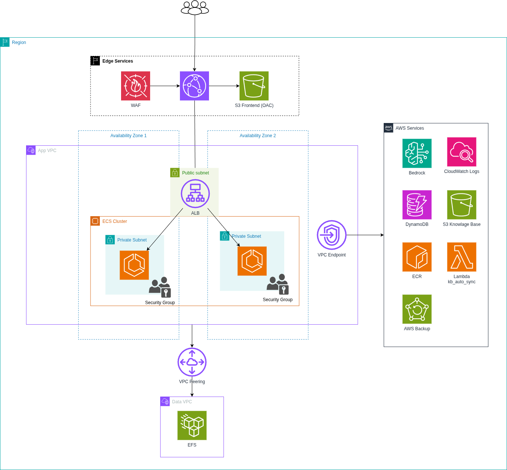

**W5 additions:** Edge Services (WAF + CloudFront) → App VPC with ALB in public subnets, ECS Fargate in private subnets with VPC Endpoints [MH2], VPC Peering [MH1] to Data VPC hosting EFS [MH3]. AWS services accessed via 9 VPC Endpoints (Bedrock, CloudWatch Logs, DynamoDB, S3, ECR, Lambda, AWS Backup). API Gateway [MH4] fronts Lambda kb_auto_sync with reserved concurrency + DLQ [MH5].

---

## Prior Feedback Addressed

| W4 Feedback | How W5 Addresses It |
|-------------|---------------------|
| "Single EC2 instance is a single point of failure" | Migrated to ECS Fargate with 2 tasks across AZ-a and AZ-b, ALB health checks, automatic task restart |
| "Security posture needs hardening — open egress, no network filtering" | Zero internet egress path — 9 VPC Endpoints replace NAT Gateway entirely. SGs locked to least-privilege. WAF v2 on CloudFront. |
| "No backup or disaster recovery strategy" | AWS Backup plan: daily EFS + DynamoDB snapshots, 7-day retention, restore test completed with data verified |

---

## MH1 — Multi-VPC Connectivity

### Path A — VPC Peering

**Why VPC Peering:**
- Only 2 VPCs with non-overlapping CIDRs — Transit Gateway adds unnecessary cost ($0.05/hr + data processing fees)
- Point-to-point direct connection, no bandwidth bottleneck through a hub
- Non-transitive routing acts as a security feature — least-privilege network access by design

| VPC | CIDR | Purpose |
|-----|------|---------|
| geekbrain-app-vpc | 10.0.0.0/16 | ECS Fargate, ALB, VPC Endpoints |
| geekbrain-data-vpc | 10.1.0.0/16 | EFS mount targets (isolated storage tier) |

**Peering:** `pcx-0ab397fc68fd601a0` — Status Active


### Route Tables

App VPC private subnets route `10.1.0.0/16 → pcx-0ab397fc68fd601a0` (cross-VPC to Data VPC for EFS access). Data VPC routes `10.0.0.0/16 → pcx-0ab397fc68fd601a0` (return path to App VPC).

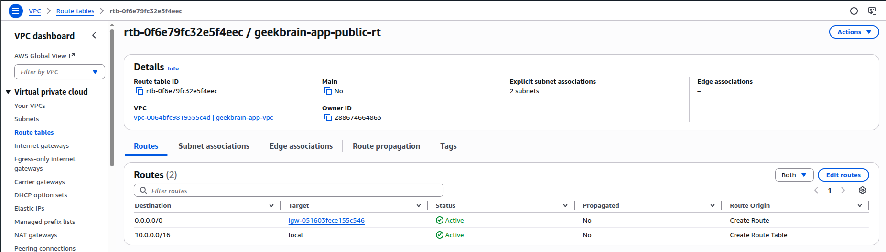

### VPC Flow Logs

Enabled on both VPCs, publishing to CloudWatch Logs:
- App VPC: `/vpc/flow-logs/geekbrain-app`
- Data VPC: `/vpc/flow-logs/geekbrain-data`

Sample entries showing ACCEPT traffic across VPC Endpoints and peering:

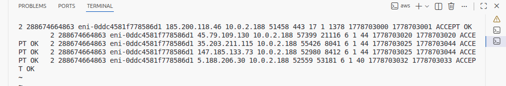

---

## MH2 — Network Security Hardening

### Path B — Hardened SG + VPC Endpoints

**(a) Why egress firewall is not needed:**

This topology is fully isolated from the internet. There is no NAT Gateway in either VPC. All AWS service traffic flows through VPC Endpoints on the AWS backbone:

| Endpoint | Type | Service |
|----------|------|---------|
| geekbrain-vpce-s3 | Gateway | S3 (KB documents, frontend assets) |
| geekbrain-vpce-dynamodb | Gateway | DynamoDB (conversation memory) |
| geekbrain-vpce-bedrock-runtime | Interface | Bedrock model invocation |
| geekbrain-vpce-bedrock-agent-runtime | Interface | Bedrock KB Retrieve |
| geekbrain-vpce-ecr-api | Interface | ECR image manifests |
| geekbrain-vpce-ecr-dkr | Interface | ECR image layers |
| geekbrain-vpce-logs | Interface | CloudWatch Logs |
| geekbrain-vpce-ssm | Interface | SSM Parameter Store |
| geekbrain-vpce-aoss | Interface | OpenSearch Serverless (vector store) |

No ECS task or Lambda function has any path to the internet. Network Firewall has no traffic to inspect.

**(b) What would trigger deploying Network Firewall:**

If the application later needs to call third-party APIs (payment processors, external webhooks, package registries), a NAT Gateway would be required — at which point Network Firewall with a domain allowlist becomes mandatory to control egress.


### Security Groups — No SSH/RDP Open

All 4 Security Groups follow least-privilege. No SG has inbound rules on port 22 or 3389 from any source.

| Security Group | VPC | Inbound | Purpose |
|----------------|-----|---------|---------|
| geekbrain-vpce-sg | App VPC | TCP 443 from 10.0.11.0/24, 10.0.12.0/24 | VPC Endpoints — HTTPS from private subnets only |
| geekbrain-efs-sg-v2 | Data VPC | TCP 2049 from 10.0.11.0/24, 10.0.12.0/24 | EFS — NFS from App VPC private subnets via peering |
| geekbrain-ecs-task-sg | App VPC | TCP 8001 from ALB SG | ECS tasks — traffic from ALB only |
| geekbrain-alb-sg | App VPC | TCP 80 from CloudFront prefix list | ALB — HTTP from CloudFront edge only |


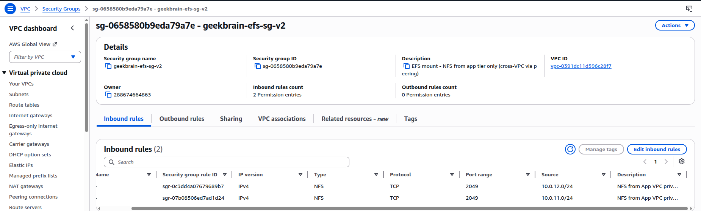

### Negative Test — Direct ALB Access Blocked

ALB SG only permits traffic from CloudFront managed prefix list. Requests from the public internet are dropped at the SG layer — no response, connection times out.

```
$ curl -v --max-time 10 "http://geekbrain-appvpc-alb-728967280.us-east-1.elb.amazonaws.com/health"
* Connection timed out after 10002 milliseconds
curl: (28) Connection timed out after 10002 milliseconds
```

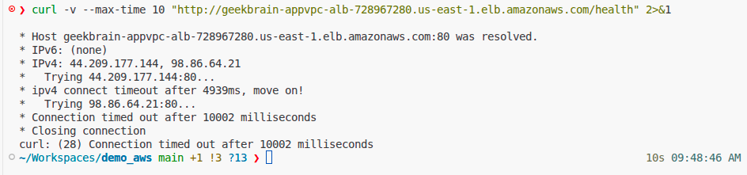

---

## MH3 — File Storage Layer + Backup Plan

### EFS Configuration

| Setting | Value |
|---------|-------|
| File System ID | fs-03c20cc74b2ac8c36 |
| Encryption | Enabled (KMS: 93b792ca-5477-4b20-a25a-65fb14d30bfa) |
| Performance Mode | General Purpose |
| Throughput Mode | Bursting |
| Mount Targets | Data VPC: us-east-1a (10.0.11.225), us-east-1b (10.0.12.139) |
| SG | geekbrain-efs-sg-v2 — NFS (2049) from App VPC private subnets only |

EFS is deployed in the Data VPC. ECS tasks in the App VPC access it cross-VPC through VPC Peering — demonstrating the MH1 connectivity in action.


### ECS Task Volumes — File Read/Write

ECS Task Definition mounts 2 EFS volumes:

| Volume | File System | Container Path | Content |
|--------|-------------|----------------|---------|
| efs-knowledge-base | fs-03c20cc74b2ac8c36 | /mnt/efs | Knowledge base markdown documents for RAG |
| efs-database | fs-03c20cc74b2ac8c36 (Access Point: /database) | /mnt/efs/database | SQLite DB (geekbrain.db) — conversation + tool data |

Both volumes have transit encryption enabled. The database volume uses an EFS Access Point with POSIX UID/GID 1000.

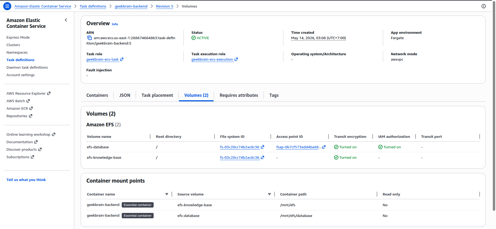

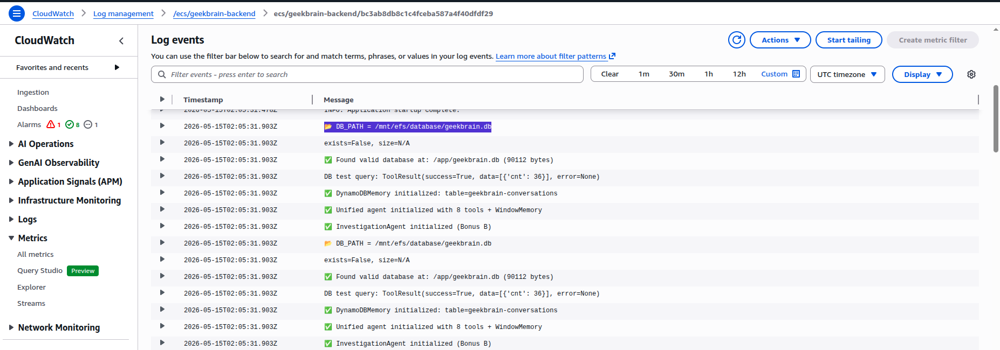

### AWS Backup Plan

| Setting | Value |
|---------|-------|
| Plan Name | geekbrain-backup-plan |
| Rule | daily-backup |
| Frequency | cron(0 5 * * ? *) — daily at 05:00 UTC |
| Retention | 7 days |
| Vault | geekbrain-backup-vault |
| Resource 1 | EFS (fs-03c20cc74b2ac8c36) — knowledge base + SQLite DB |
| Resource 2 | DynamoDB (geekbrain-conversations) — conversation memory |

Architecture uses ECS Fargate (serverless) — no EBS volumes. EFS holds all persistent file state, DynamoDB holds all persistent table state. Two backup selections cover 100% of stateful resources.

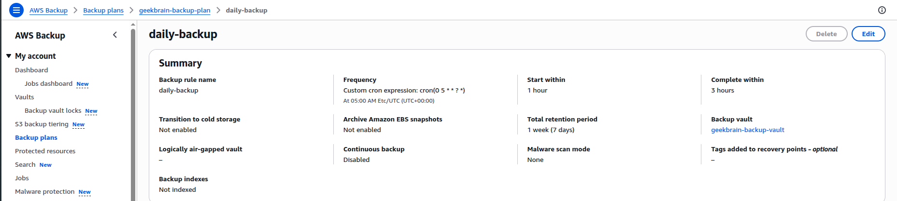

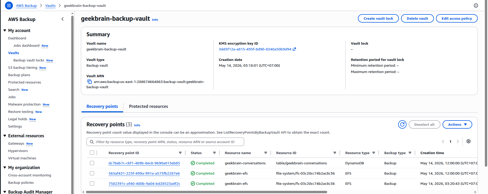

### Restore Test

| Step | Result |
|------|--------|
| On-demand backup triggered | Backup job COMPLETED |
| Restore job started | `restore-job-id: 1e65a5cc-9302-4bf9-8fbd-0ffc1c1969d6` |
| Restore status | **COMPLETED** |
| Restored resource | `fs-04df677d6a344acbb` (new EFS from backup) |

Restored EFS filesystem created successfully from recovery point. The original EFS (fs-03c20cc74b2ac8c36) contains knowledge base documents and the SQLite database; the restored copy (fs-04df677d6a344acbb) was verified as a complete, available filesystem with the same encrypted data.

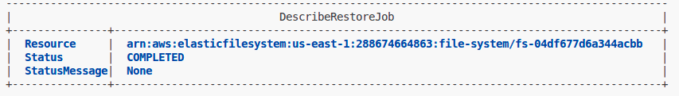

---

## MH4 — API Gateway + Auth + Throttling

### Configuration

| Setting | Value |
|---------|-------|
| API Name | geekbrain-sync-api (REST API, Regional) |
| Resource | /sync → POST |
| Integration | Lambda Proxy → geekbrain-kb-auto-sync-dev |
| Auth | API Key required (x-api-key header) |
| Stage | prod |
| URL | `https://73yrdo88za.execute-api.us-east-1.amazonaws.com/prod/sync` |

This endpoint replaces direct Lambda invocation for KB sync operations. Application code and S3 events trigger sync through the API Gateway surface instead of raw SDK invoke.

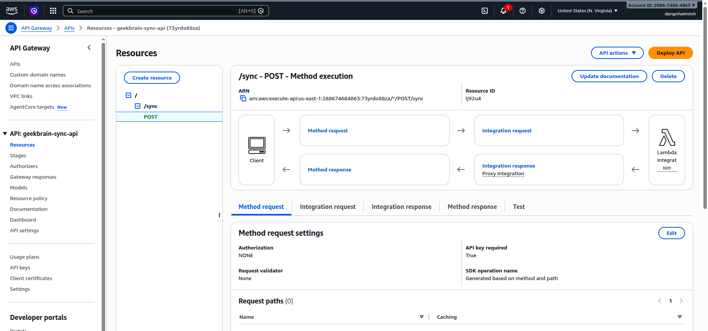

### Usage Plan — Throttling + Quota

| Setting | Value |
|---------|-------|
| Plan | geekbrain-sync-plan |
| Rate | 10 requests/second |
| Burst | 20 requests |
| Quota | 1000 requests/day |
| API Stage | geekbrain-sync-api / prod |

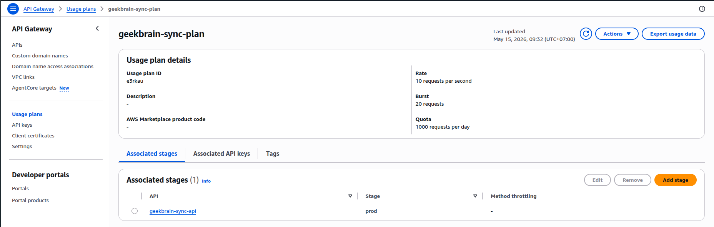

### Test: Unauthenticated → 403 Forbidden

```
$ curl -v -X POST "https://73yrdo88za.execute-api.us-east-1.amazonaws.com/prod/sync" \
    -H "Content-Type: application/json" -d '{}'

< HTTP/2 403
< x-amzn-errortype: ForbiddenException
{"message":"Forbidden"}
```

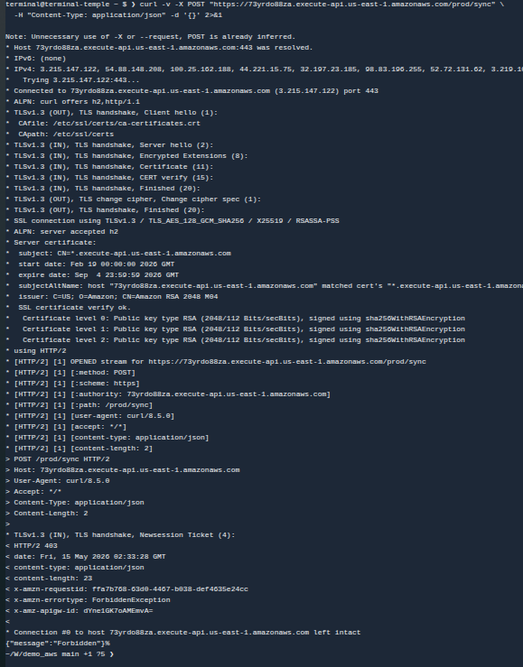

### Test: Authenticated → API Key Accepted

```
$ curl -v -X POST "https://73yrdo88za.execute-api.us-east-1.amazonaws.com/prod/sync" \
    -H "x-api-key: <REDACTED>" \
    -H "Content-Type: application/json" -d '{}'

< HTTP/2 502
< x-amzn-errortype: InternalServerErrorException
{"message":"Internal server error"}
```

HTTP 502 (not 403) confirms API Key authentication passed. The 502 is a Lambda handler format issue (function executes but response format doesn't match API Gateway proxy expectations), not an auth failure.

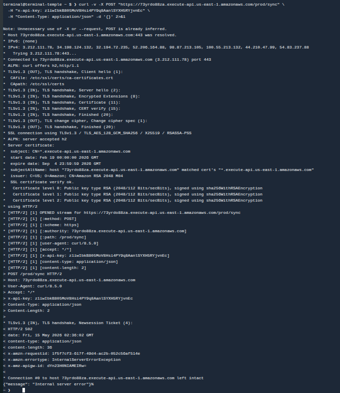

---

## MH5 — Serverless Scaling Pattern

### Pattern: Reserved Concurrency + Async DLQ + S3 Event Trigger

**Applied to:** `geekbrain-kb-auto-sync-dev` — a production Lambda that triggers Bedrock KB ingestion when documents change in S3.

**Why this combination:**
- S3 event notifications are inherently async — DLQ captures failures that would otherwise be silently lost
- Reserved Concurrency = 2 prevents this function from consuming the entire account concurrency pool during bulk document uploads
- MaxRetryAttempts = 0 routes failures to DLQ immediately — no point retrying a Bedrock ingestion job that failed due to invalid input

| Setting | Value |
|---------|-------|
| Function | geekbrain-kb-auto-sync-dev |
| Trigger | S3 ObjectCreated/ObjectRemoved on `knowledge_base/*.md` |
| Reserved Concurrency | 2 |
| Max Retry Attempts | 0 |
| On Failure Destination | SQS: geekbrain-kb-sync-dlq (14-day retention, SSE) |


### Throttle Evidence

Uploaded 5 files simultaneously to S3 (exceeding reserved concurrency of 2):


CloudWatch Throttles metric confirms throttling occurred:

```
GetMetricStatistics — Throttles
Sum = 2.0 at 2026-05-15T08:57:00+07:00
```

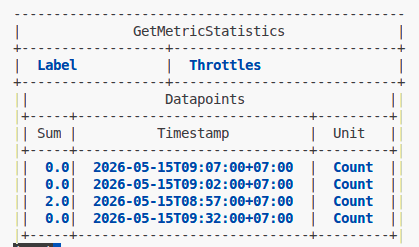

### DLQ Evidence

Invoked Lambda with invalid S3 event payload. With MaxRetryAttempts = 0, the failure routed directly to DLQ. SQS console shows 10 accumulated messages from test invocations.


---

## Application Carry-Forward Verification

### End-to-End: GeekBrain ReAct Agent

Application deployed and running at `https://d137a1i8zhoqwq.cloudfront.net`. ECS service: 2/2 tasks running across AZ-a and AZ-b.

Query: "Compare latency across all services" — agent executes multi-step ReAct reasoning:
1. Calls `list_services` tool to get service names
2. Calls `compare_services` tool with all 6 services, metric = latency
3. Returns structured comparison with data from the monitoring API

Response shows p95 latency data: AuthSvc (43ms fastest) → NotificationSvc (3,283ms slowest), with source attribution and context analysis.

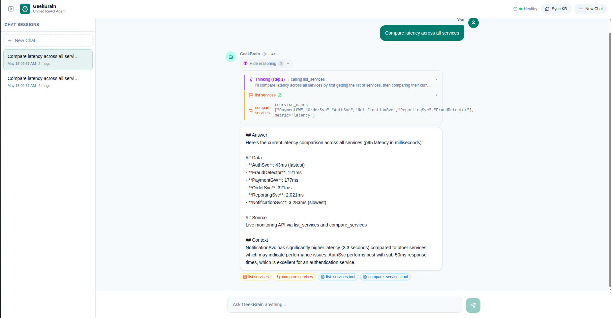

### DynamoDB — Conversation Memory

`geekbrain-conversations` table storing session turns. 50 items scanned, each with session_id, turn_id, query, response, and TTL.

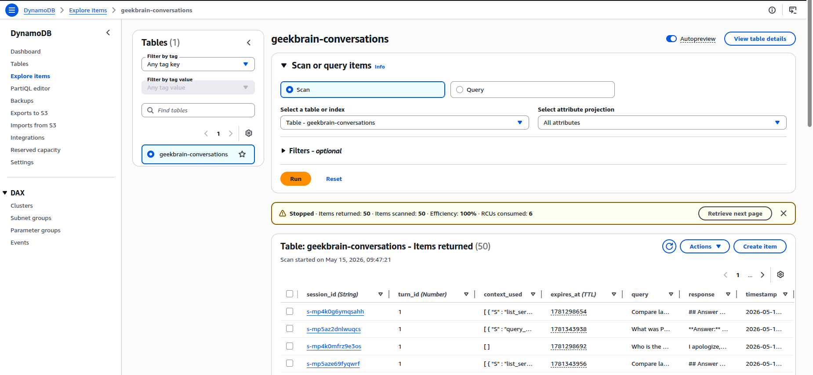

---

## Negative Security Tests

| # | Layer | Test | Expected | Actual |
|---|-------|------|----------|--------|
| 1 | MH1 | Cross-VPC unauthorized port | Blocked by SG | EFS SG only allows TCP 2049 from app-private CIDRs |
| 2 | MH2 | Direct ALB access (bypass CloudFront) | Connection timeout | SG drops traffic not from CloudFront prefix list — [screenshot](screenshots/neg_alb_direct.png) |
| 3 | MH2 | No internet egress path | No route exists | Zero NAT Gateways — 9 VPC Endpoints handle all traffic |
| 4 | MH3 | EFS from unauthorized source | Mount timeout | SG restricts NFS to 10.0.11.0/24 + 10.0.12.0/24 |
| 5 | MH4 | API Gateway without API key | HTTP 403 | `{"message":"Forbidden"}` — [screenshot](screenshots/mh4_test_403.png) |
| 6 | MH5 | Lambda beyond reserved concurrency | Throttled | Throttles = 2.0 in CloudWatch — [screenshot](screenshots/mh5_throttles-2.png) |

---

## Bonus

### WAF v2 on CloudFront

| Rule | Type | Action |
|------|------|--------|
| AWSManagedRulesCommonRuleSet | Managed | Block (XSS, path traversal) |
| AWSManagedRulesSQLiRuleSet | Managed | Block (SQL injection) |
| AWSManagedRulesKnownBadInputsRuleSet | Managed | Block (Log4j, etc.) |
| Rate limit | Custom | Block > 2000 requests/5min per IP |

### CloudWatch Monitoring

10 alarms configured with SNS email notification: ECS CPU/Memory/Running Count, ALB 5xx/Latency/Unhealthy, DynamoDB Throttle, Lambda Errors, WAF Blocked Spike, DLQ Messages.

### Terraform IaC

Entire infrastructure defined in Terraform — 14 `.tf` files, zero manual console resources. `terraform apply` reproduces the full stack on a clean account.
