# W6 Evidence Pack: Operations Hardening & Cost-Aware Cloud

## Section 1 — Cover

| Field | Value |
|-------|-------|
| Group | GROUP 5 — XBrain |
| Members | Minh - Quang Vinh - Hoang - Nam - Quyen - Thuy - Son |
| Repository | https://github.com/me-dangnhatminh/xbrain-dangnhatminh |
| W5 Evidence Pack | [W5 Evidence](../docs/W5_evidence.md) |
| Date | 2026-05-22 |
| Application | GeekBrain AI — Fintech monitoring & incident investigation platform |
| Stack | ECS Fargate (FastAPI), DynamoDB, Bedrock KB, S3, CloudFront, ALB |
| IaC | Terraform (all resources) |

### Architecture Diagram


---

## Section 2 — MH-COST-V: Cost Visibility & Attribution

### Component 1 — Tagging Strategy

All billable resources are tagged via Terraform `default_tags` in the AWS provider block ([main.tf](../terraform/main.tf)):

| Tag Key | Value | Rule |
|---------|-------|------|
| `Owner` | `dangnhatminh09032002@gmail.com` | Single accountable person — consistent email format |
| `Environment` | `dev` | Lowercase only — never "Dev" or "DEV" |
| `CostCenter` | `G5` | Group identifier — matches Billing console allocation |
| `Application` | `geekbrain` | Consistent lowercase — used in Cost Explorer filter |
| `Project` | `geekbrain` | Terraform project name prefix |

**Enforcement mechanism:** Terraform `default_tags` applies all five keys to every resource created in the provider scope. Any resource created outside Terraform would be caught by the Cost Guard Lambda (MH-COST-A) if it lacks `keep=true`.

**Evidence — Tags applied to 3+ resource types:**

| Resource Type | Screenshot |
|--------------|-----------|
| Lambda Functions | 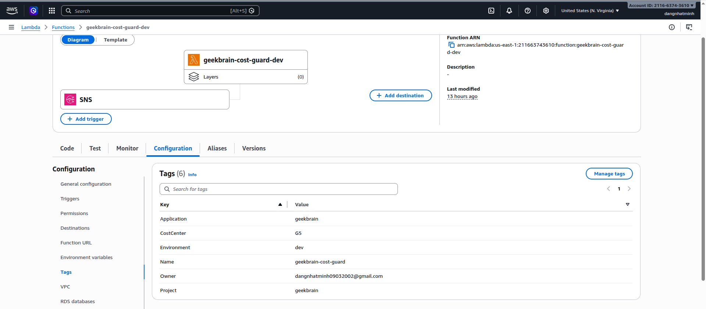 |
| S3 Buckets | 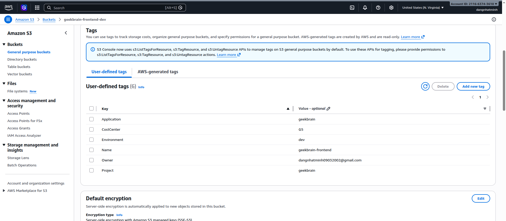 |
| ECS Service | 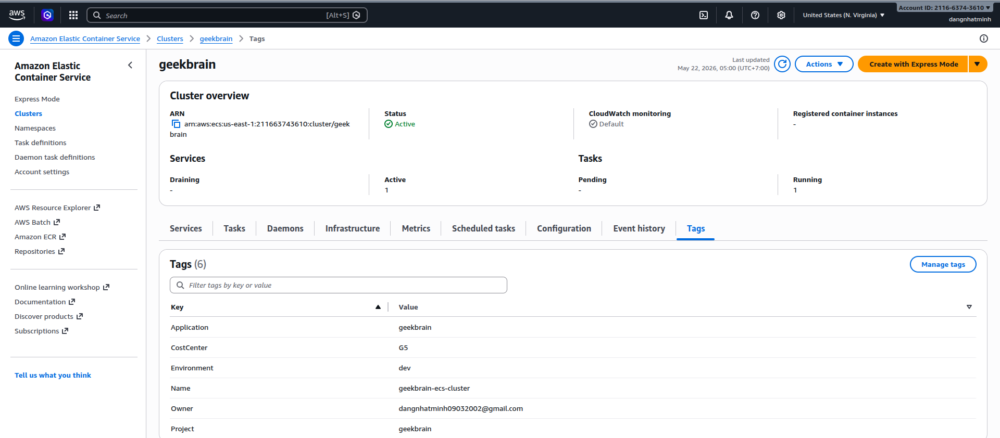 |

All resources carry the five required tag keys with consistent values and capitalization.

### Component 2 — Cost Allocation Tags Activated

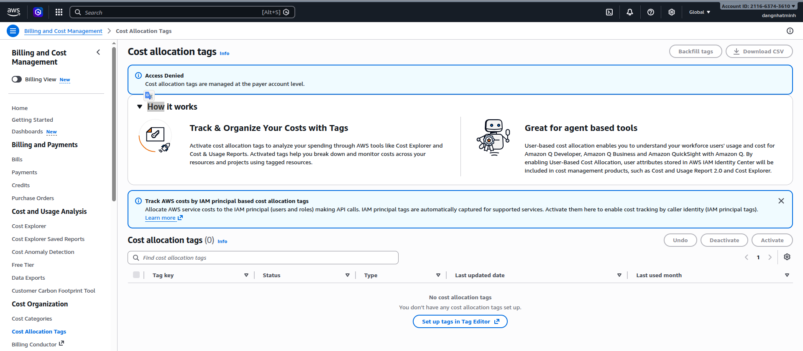

Tags `Owner`, `Application`, `CostCenter`, and `Environment` are activated in the Billing console (Settings > Cost allocation tags). This is the required second step — without activation, Cost Explorer cannot group costs by tag even if every resource is tagged.

### Component 3 — Cost Monitoring Tools Configured

**AWS Budgets** — $150 monthly budget configured with two alert thresholds:
- 80% threshold ($120) → SNS → Cost Guard Lambda
- 100% threshold ($150) → SNS → Cost Guard Lambda

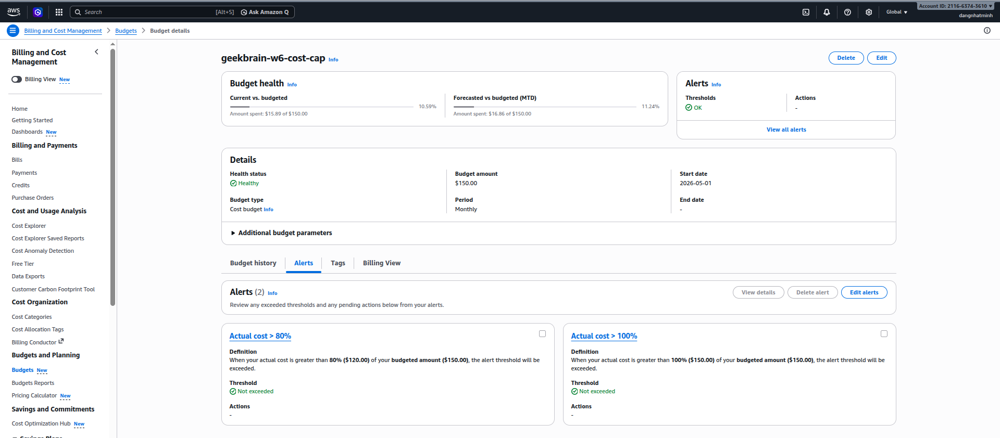

The budget is defined in Terraform ([cost_guard.tf](../terraform/cost_guard.tf), lines 187-210) and wires directly to the Cost Guard Lambda via SNS for automated action — not just notification.

**Cost Explorer** — filtered by `Application=geekbrain` tag:


### Component 4 — Baseline Cost Breakdown

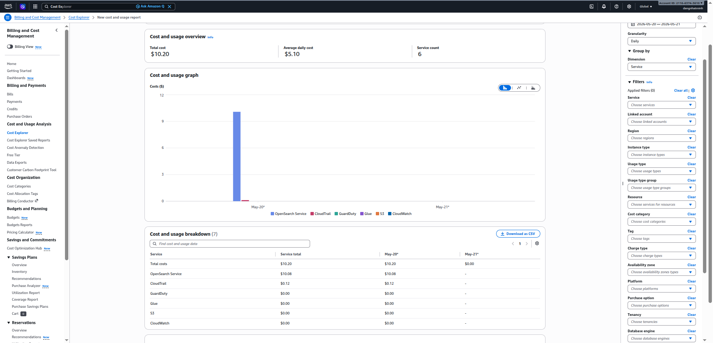

**Top-3 cost drivers observation:**

1. **EC2 (NAT instance)** — Running a t3.micro NAT EC2 instance to replace 7 VPC Interface Endpoints (cost: ~$0.50/day vs ~$7/day for endpoints). This was an active cost optimization decision documented in commit `0319954`.
2. **ECS Fargate** — Single task (0.25 vCPU / 0.5 GB) running the backend API in a private subnet. Smallest possible Fargate configuration for a functional deployment.
3. **S3 + CloudFront** — Minimal storage for KB documents and static frontend hosting. CloudFront provides caching to reduce origin requests.

**Cost discipline choices to stay ≤ $150:**
- Single-AZ deployment (no Multi-AZ redundancy in dev)
- Smallest instance types: t3.micro NAT, 0.25 vCPU Fargate task
- Serverless where possible: Lambda, DynamoDB PAY_PER_REQUEST, S3
- NAT EC2 instead of NAT Gateway ($0.045/hr savings)
- No Bedrock Provisioned Throughput — on-demand inference only
- No OpenSearch — using Bedrock KB with S3 data source


Account total is well under the $150 cap.

---

## Section 3 — MH-COST-A: Cost Control & Action (Automated Cost Guard)

### Component (a) — Stop Lambda

**Lambda function:** `geekbrain-cost-guard-dev`  
**Runtime:** Python 3.11  
**Source:** [cost_guard_lambda.py](../lambda/cost_guard_lambda.py)

The Lambda iterates all running EC2 instances and ECS tasks, checks for the `keep=true` tag, and stops any resources lacking it. Logic:
1. `describe_instances` with filter `instance-state-name=running`
2. For each instance: check tags → if `keep` != `true` → `stop_instances`
3. `list_clusters` → `list_tasks` → `describe_tasks` → if no `keep=true` tag → `stop_task`

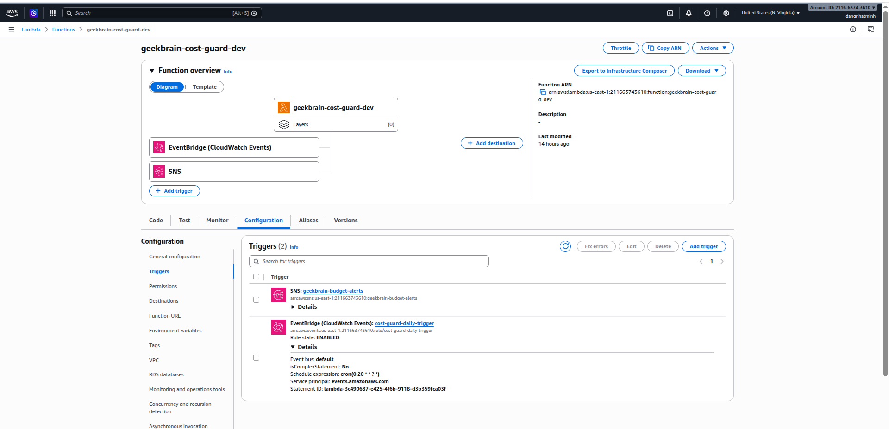

**Least-privilege IAM role** ([cost_guard.tf](../terraform/cost_guard.tf), lines 34-61):

| Action | Purpose |
|--------|---------|
| `ec2:DescribeInstances` | Find running EC2 instances |
| `ec2:StopInstances` | Stop untagged instances |
| `ecs:ListClusters` | Enumerate ECS clusters |
| `ecs:ListTasks` | Find running tasks |
| `ecs:DescribeTasks` | Check task tags |
| `ecs:StopTask` | Stop untagged tasks |
| `cloudwatch:PutMetricData` | Publish ResourcesStopped metric |

No wildcards on action names. Resource scope is `*` because the Lambda must scan all instances/tasks across the account, but the actions are tightly scoped.

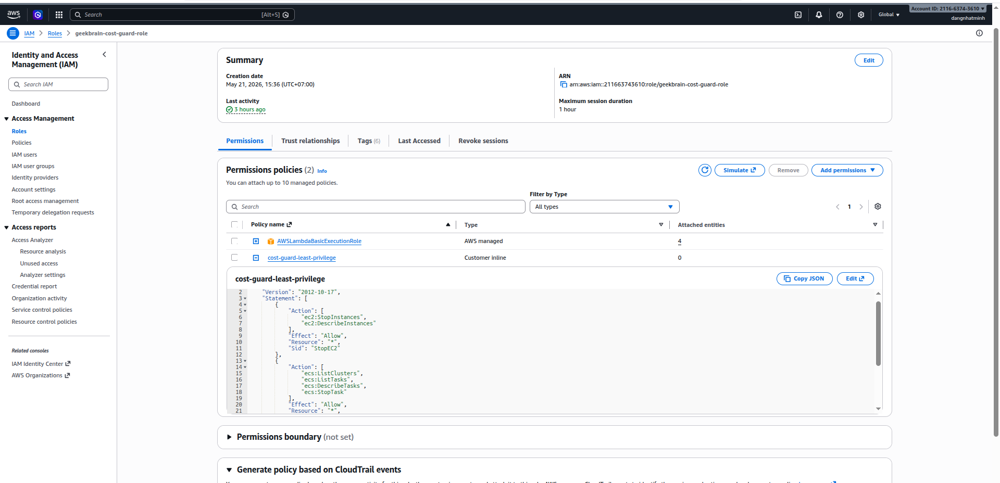

### Component (b) — Daily Scheduled Trigger

**EventBridge Scheduler:** `geekbrain-cost-guard-daily`  
**Schedule:** `cron(0 20 * * ? *)` — daily at 20:00 UTC  
**Terraform:** [cost_guard.tf](../terraform/cost_guard.tf), lines 119-135

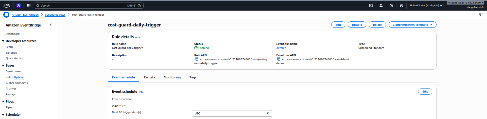

### Component (c) — Demonstrated Action (Resource Actually Stopped)

**Before state** — EC2 instance running without `keep=true` tag:


**Lambda invocation** — Cost Guard fires and stops the instance:


**After state** — Instance stopped by automation:


**CloudTrail evidence** — `StopInstances` API call by the Cost Guard Lambda role:


The CloudTrail event shows `userIdentity.arn` matching the Cost Guard Lambda execution role, confirming the stop was performed by automation — not manually.

### Component (d) — Budgets → SNS → Lambda (Cost-Driven Path)

**Wiring:** AWS Budgets ($150) → SNS topic `geekbrain-budget-alerts` → Lambda `geekbrain-cost-guard-dev`

The SNS topic has two subscribers:
1. Lambda function (automated stop action)
2. Email (human notification)


Email subscription confirmed via Gmail:


**Test SNS publish** — demonstrating the chain by publishing a test message:


**Lambda triggered by SNS** — the Cost Guard processes the SNS event and stops resources:


### Latency ADR (Architecture Decision Record)

**Decision:** Accept that the AWS Budgets cost-driven trigger will likely NOT fire in the 48-hour workshop account lifecycle.

**Context:** AWS cost data lags ~8-24 hours. In a 48-hour account, the real spend may not be reflected in Budgets before the demo. This is a known AWS limitation, not a gap in our automation.

**Consequences:**
- The **scheduled daily cron** (Component b) is the primary enforcement mechanism — it fires reliably every 24h regardless of cost data lag.
- The **Budgets → SNS → Lambda** path is wired and demonstrated via test publish (Component d), proving the chain works end-to-end.
- In a production account with a longer lifecycle, both paths would fire: the scheduled cron catches resources daily at 20:00 UTC, and the Budgets trigger provides an additional reactive safety net when actual spend crosses the threshold.

**Production behavior:** If this were a long-lived production account, the daily cron stops untagged resources every evening. If something slips through (e.g., launched at 20:01 UTC), the Budgets trigger would catch it within 8-24 hours when the cost data updates and the $150 threshold is breached.

---

## Section 4 — MH-OBS: CloudWatch Observability

### Component A — Dashboard with Custom Metric

**Dashboard name:** `geekbrain-w6-ops`  
**Terraform:** [dashboard.tf](../terraform/dashboard.tf)

The dashboard contains 11 widgets across 5 rows:

| Widget | Type | Metric Source |
|--------|------|--------------|
| Bedrock Query Latency | **Custom metric** | `GeekBrain/Application` / `BedrockQueryLatencyMs` |
| Bedrock Query Count | **Custom metric** | `GeekBrain/Application` / `BedrockQueryCount` |
| ECS CPU Utilization | Standard | `AWS/ECS` / `CPUUtilization` |
| ECS Memory Utilization | Standard | `AWS/ECS` / `MemoryUtilization` |
| Lambda KB-Sync Errors | Standard | `AWS/Lambda` / `Errors` + `Invocations` |
| ALB 5xx Errors | Standard | `AWS/ApplicationELB` / `HTTPCode_Target_5XX_Count` |
| ALB Target Response Time | Standard | `AWS/ApplicationELB` / `TargetResponseTime` |
| Cost Guard Resources Stopped | Custom | `GeekBrain/CostGuard` / `ResourcesStopped` |
| Security Guard Remediations | Custom | `GeekBrain/SecurityGuard` / `RemediationsApplied` |
| DynamoDB Throttled Requests | Standard | `AWS/DynamoDB` / `ThrottledRequests` |
| Active CloudWatch Alarms | Alarm widget | Composite alarm status |

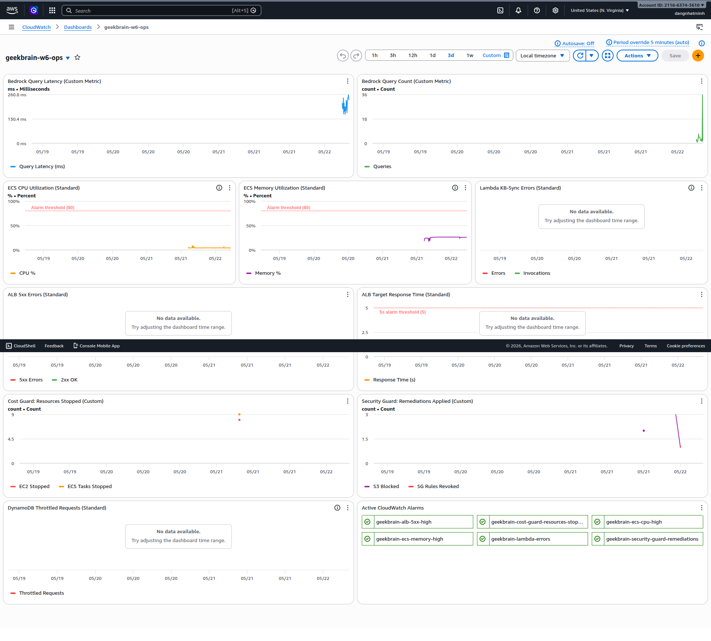

**Custom metric widget (Bedrock Query Latency):**

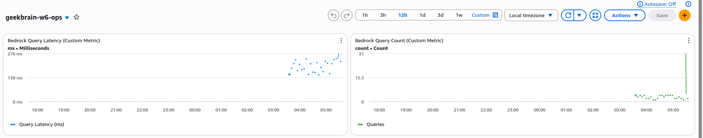

**Custom namespace `GeekBrain/Application` visible in CloudWatch:**

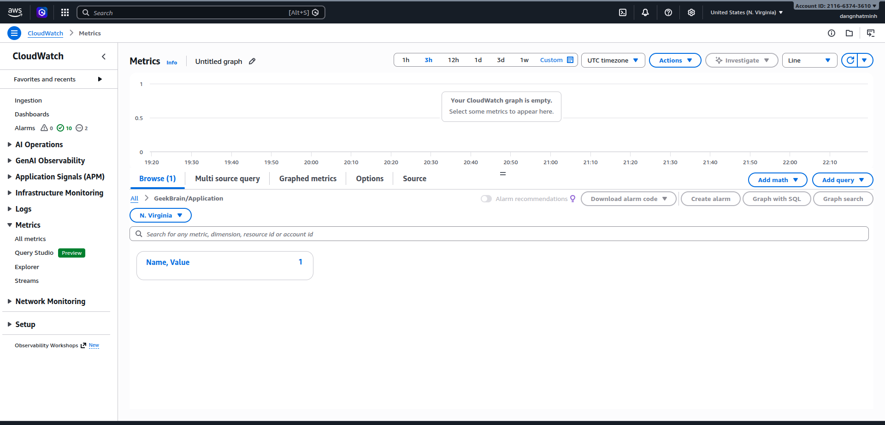

**`PutMetricData` code** — from [kb_auto_sync_lambda.py](../lambda/kb_auto_sync_lambda.py), lines 32-46:

```python
def _put_metric(metric_name: str, value: float, unit: str = "Count"):
    """Publish a custom metric to GeekBrain/Application namespace."""
    try:
        _get_cw().put_metric_data(
            Namespace="GeekBrain/Application",
            MetricData=[{
                "MetricName": metric_name,
                "Dimensions": [{"Name": "Service", "Value": "geekbrain-backend"}],
                "Value": value,
                "Unit": unit,
            }]
        )
    except Exception as exc:
        logger.warning("[MH-OBS] Failed to publish metric %s: %s", metric_name, exc)
```

Published metrics: `BedrockQueryLatencyMs` (Milliseconds), `BedrockQueryCount` (Count), `KBSyncItemsCount` (Count), `KBSyncLatencyMs` (Milliseconds), `KBSyncSuccess` / `KBSyncFailure`.

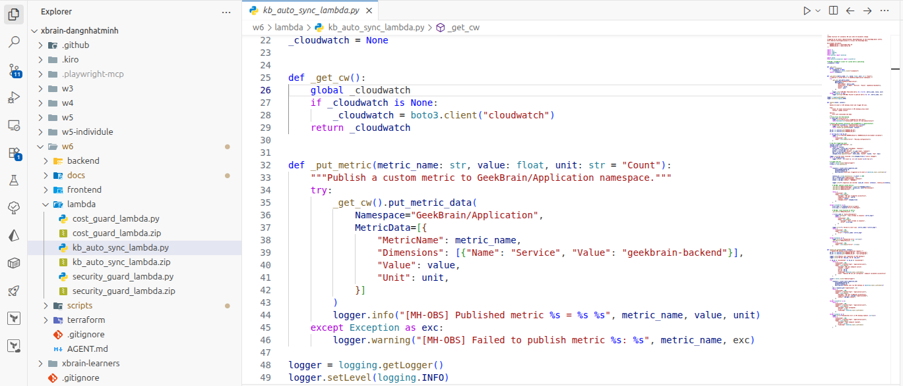

### Component B — CloudWatch Alarm in OK State

**Alarms configured** (9 total, defined in [monitoring.tf](../terraform/monitoring.tf)):

| Alarm | Metric | Threshold | State |
|-------|--------|-----------|-------|
| `geekbrain-ecs-cpu-high` | ECS CPUUtilization | > 80% for 10m | OK |
| `geekbrain-ecs-memory-high` | ECS MemoryUtilization | > 80% for 10m | OK |
| `geekbrain-ecs-no-running-tasks` | RunningTaskCount | < 1 | OK |
| `geekbrain-alb-5xx-high` | HTTPCode_Target_5XX_Count | > 10/5m | OK |
| `geekbrain-alb-latency-high` | TargetResponseTime | > 5s for 15m | OK |
| `geekbrain-alb-unhealthy-hosts` | UnHealthyHostCount | > 0 | OK |
| `geekbrain-dynamodb-throttled` | ThrottledRequests | > 5/5m | OK |
| `geekbrain-lambda-errors` | Lambda Errors | > 3/5m | OK |
| `geekbrain-waf-blocked-spike` | BlockedRequests | > 100/5m | OK |

**Alarm triggered (ALARM state)** — demonstrating the alarm fires:

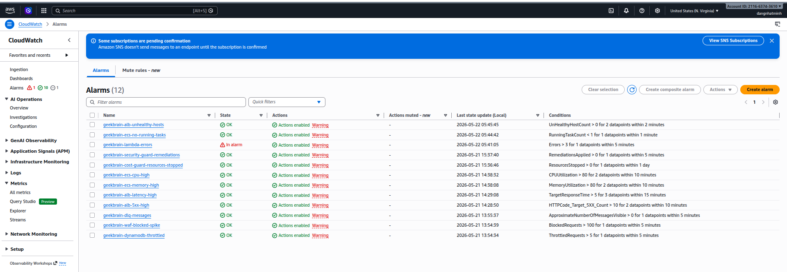

**Alarm recovered to OK state:**

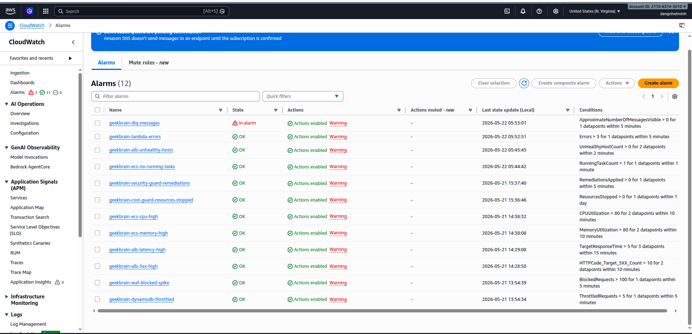

**All alarms — no INSUFFICIENT_DATA:**


All alarms are action-configured (SNS → email notification on both ALARM and OK transitions).

### Component C — Log Insights Query Saved

**Saved queries** (4 defined in Terraform via `aws_cloudwatch_query_definition`):

| Query Name | Log Group | Purpose |
|-----------|-----------|---------|
| `GeekBrain/ECS-Error-Spikes` | ECS backend logs | Error count by 5-minute window |
| `GeekBrain/Bedrock-Query-Latency` | ECS backend logs | Bedrock latency extraction with parse/stats |
| `GeekBrain/SecurityGuard-Remediation-Audit` | Security Guard Lambda | Remediation action audit trail |
| `GeekBrain/CostGuard-Stop-Audit` | Cost Guard Lambda | Daily stop event audit |

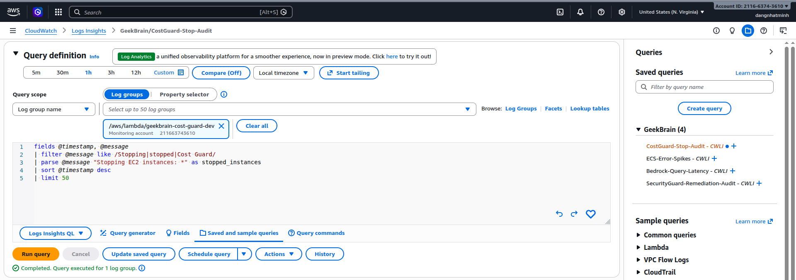

**Query results** — `GeekBrain/ECS-Error-Spikes` against real ECS log group:

```
fields @timestamp, @message
| filter @message like /ERROR|Exception|5[0-9][0-9]/
| stats count(*) as error_count by bin(5m)
| sort @timestamp desc
| limit 20
```

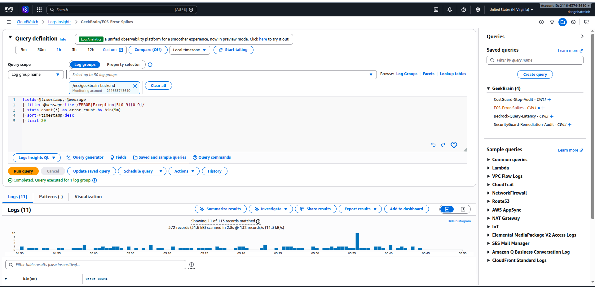

The query uses `filter`, `stats`, `sort`, and `limit` — not just a timestamp filter. Results show real data from the deployed application.

---

## Section 5 — MH-SEC: Self-Healing Security Guard

### Auto-Fix Lambda

**Lambda function:** `geekbrain-security-guard-dev`  
**Runtime:** Python 3.11  
**Source:** [security_guard_lambda.py](../lambda/security_guard_lambda.py)

The Security Guard detects and auto-fixes **TWO** security misconfigurations:

1. **S3 bucket made public** → calls `PutPublicAccessBlock` to re-enable full Block Public Access
2. **Security Group with 0.0.0.0/0 on port 22/3389** → calls `RevokeSecurityGroupIngress` to remove the dangerous rule


**Least-privilege IAM role** ([security_guard.tf](../terraform/security_guard.tf), lines 34-69):

| Action | Purpose |
|--------|---------|
| `s3:ListAllMyBuckets` | Enumerate buckets for sweep |
| `s3:GetBucketPublicAccessBlock` | Check current BPA status |
| `s3:PutBucketPublicAccessBlock` | Remediate — enable BPA |
| `s3:GetBucketPolicyStatus` | Detect public policy |
| `s3:GetBucketAcl` | Detect public ACL |
| `ec2:DescribeSecurityGroups` | Enumerate SGs for sweep |
| `ec2:RevokeSecurityGroupIngress` | Remediate — revoke open rules |
| `cloudwatch:PutMetricData` | Publish RemediationsApplied metric |

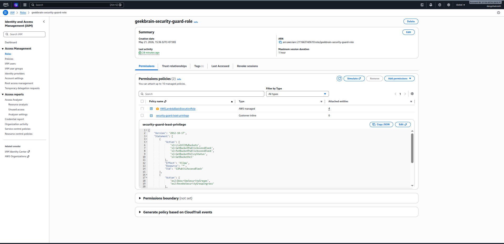

### Trigger Configuration

**Two triggers — both deployed:**

1. **EventBridge Rule (near real-time):** Fires on CloudTrail events `DeletePublicAccessBlock`, `PutBucketPolicy`, `PutBucketAcl`, `AuthorizeSecurityGroupIngress` — catches violations within seconds.

2. **EventBridge Scheduler (daily fallback):** `cron(0 21 * * ? *)` at 21:00 UTC — sweeps all buckets and SGs in case the event-driven trigger missed anything.

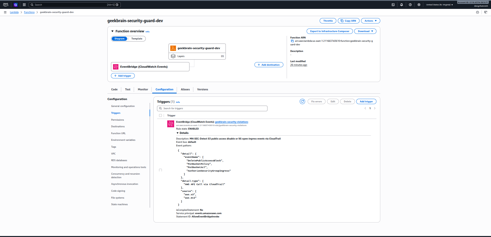

### Demonstrated Detect → Fix Loop (S3 Public Access)

**Step 1 — Create violation (make bucket public by disabling Block Public Access):**


**Step 2 — Lambda fires and remediates:**


**Step 3 — After state (Block Public Access re-enabled):**


**Step 4 — CloudTrail evidence of `PutPublicAccessBlock` API call by the Security Guard Lambda:**


The CloudTrail event shows:
- `eventName`: `PutPublicAccessBlock`
- `userIdentity.arn`: matches the Security Guard Lambda execution role
- Confirms the remediation was performed by automation, not manually

### Supporting Preventive Control — Path A: KMS CMK

**KMS Customer Managed Key:** `alias/geekbrain-s3-kb-prod`  
**Applied to:** S3 Knowledge Base bucket (`geekbrain-kb-dev`)  
**Key rotation:** Enabled (automatic annual rotation)  
**Terraform:** [security_guard.tf](../terraform/security_guard.tf), lines 192-267

**Key policy separates admin from use:**
- Root account: full KMS access (admin)
- S3 service: `kms:GenerateDataKey`, `kms:Decrypt` (use)
- Bedrock KB role: `kms:GenerateDataKey`, `kms:Decrypt` (use)
- ECS task role: `kms:GenerateDataKey`, `kms:Decrypt` (use)


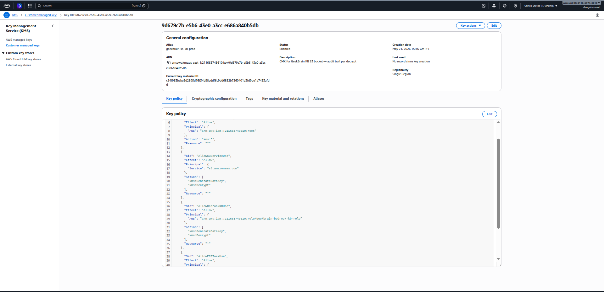

**CloudTrail verification** — `kms:Decrypt` events from `s3.amazonaws.com` confirming active CMK usage:

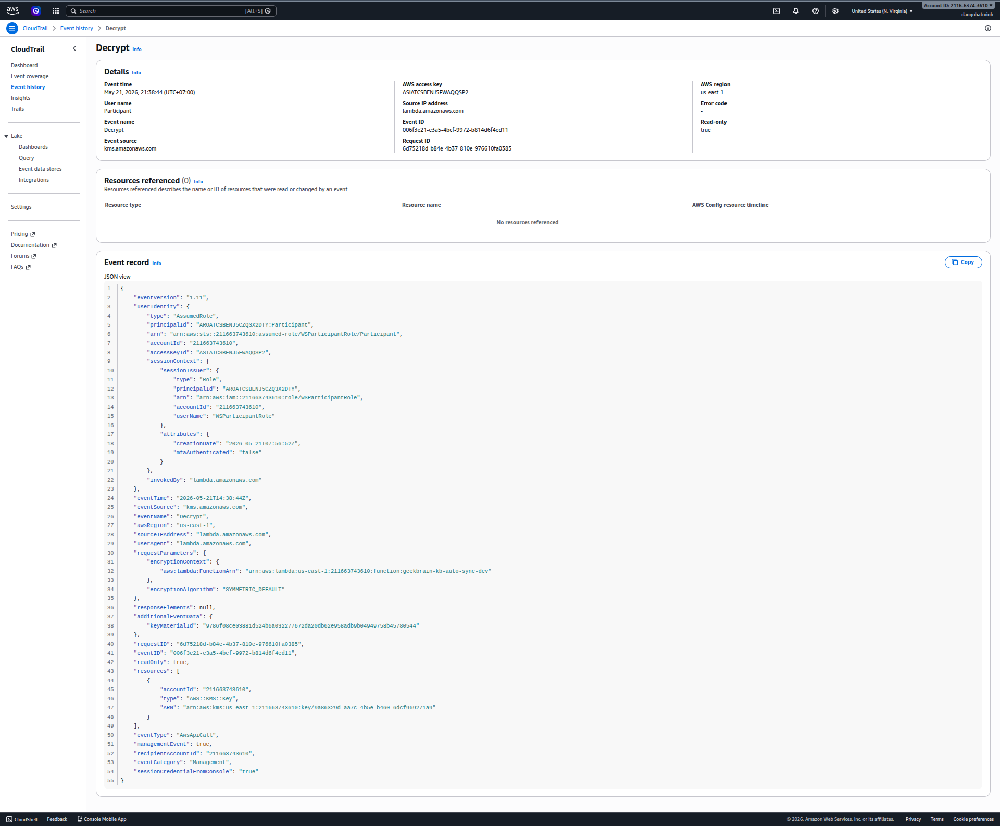

### Security Threat Statement

**What the guard fixes:** The Self-Healing Security Guard detects S3 buckets with Block Public Access disabled (or absent) and Security Groups with ingress rules open to `0.0.0.0/0` on SSH (22) or RDP (3389). Both are high-severity misconfigurations.

**Blast radius if unremediated:**
- A public S3 bucket containing the Knowledge Base documents would expose proprietary fintech operational data (incident reports, team structures, service configurations) to the internet.
- An open SSH rule would expose compute instances to brute-force attacks from any IP worldwide, potentially leading to full infrastructure compromise.

### Security-Cost Trade-Off Statement

**CMK costs $1/month per key. Justified because the Knowledge Base contains proprietary fintech operational data — the CMK provides a per-principal audit trail via CloudTrail `kms:GenerateDataKey` events, making it possible to trace exactly which IAM principal accessed the encrypted documents. This audit trail is a data governance requirement, not a convenience feature. Given the $150 weekly cap, $1/month for encryption key governance is negligible (~0.7% of budget) and eliminates the risk of untraceable data access.**

---

## Section 6 — Project Recap

### What the Application Is

**GeekBrain AI** is an intelligent fintech monitoring and incident investigation platform. It provides a natural-language interface for operations teams to query service health, investigate incidents, analyze performance metrics, and access organizational knowledge — all through an AI-powered conversational agent.

### Business Domain

The platform serves a fintech startup operating 6 microservices (PaymentGW, OrderSvc, AuthSvc, NotificationSvc, ReportingSvc, FraudDetector). Operations engineers use GeekBrain to:
- Monitor real-time service health and latency metrics
- Investigate historical incidents with root-cause context
- Query the knowledge base for operational runbooks and team information
- Perform multi-step investigations across data sources

### Key Design Decisions Carried Forward from W1-W5

| Week | Decision | Rationale |
|------|----------|-----------|
| W1 | 3-tier architecture: CloudFront → ALB → ECS Fargate → DynamoDB/S3 | Serverless compute + managed services minimize operational burden |
| W2 | S3 for KB documents, DynamoDB for conversation memory, IAM least-privilege | Cost-efficient storage with TTL-based auto-cleanup |
| W3 | Bedrock Knowledge Base with S3 data source, Lambda auto-sync | Managed RAG pipeline — no self-hosted vector DB cost |
| W4 | Unified ReAct agent with 8 tools, DynamoDB conversation memory | Single model orchestrates all tools autonomously; no hardcoded routing |
| W5 | Single VPC with private subnets, NAT EC2, CloudFront + WAF, API Gateway | Defense-in-depth: WAF rate-limiting, CloudFront origin verification, no public-facing ALB |

### Architecture Stack (W6 Deployment)

```
User → CloudFront (WAF) → ALB → ECS Fargate (FastAPI)
                                      ↓
                          Bedrock KB ← S3 (KMS-CMK encrypted)
                          DynamoDB (conversation memory)
                          Lambda (KB auto-sync, Cost Guard, Security Guard)
                          EventBridge (scheduled triggers + event rules)
                          CloudWatch (dashboard, alarms, Log Insights)
                          SNS (alerts, budget actions)
```

### W6 Operational Layers Added

The W6 work adds four operational layers to this existing architecture without changing the application logic:

1. **Cost Visibility (MH-COST-V):** Terraform `default_tags` on all resources + activated cost allocation tags + Budgets alert + baseline cost analysis
2. **Cost Control (MH-COST-A):** Automated Cost Guard Lambda stopping untagged compute on a daily schedule and via Budget → SNS trigger
3. **Monitoring (MH-OBS):** CloudWatch dashboard with custom metrics, 9 alarms (all in OK state), 4 saved Log Insights queries
4. **Security (MH-SEC):** Self-Healing Security Guard auto-fixing S3 public access and open SG rules, backed by KMS CMK preventive control

### Live Application


---

## Bonus Section

### Bonus (+0.25): Second Misconfiguration Auto-Fix

The Self-Healing Security Guard handles **TWO** distinct misconfigurations (not just one):

1. **S3 bucket made public** → `PutPublicAccessBlock` (demonstrated above with full before/after + CloudTrail)
2. **Security Group open to 0.0.0.0/0 on port 22/3389** → `RevokeSecurityGroupIngress`

Both remediation paths are in the same Lambda ([security_guard_lambda.py](../lambda/security_guard_lambda.py)):
- `remediate_s3_public_access()` — lines 40-91
- `remediate_sg_open_ssh()` — lines 98-141

Both fire on every invocation (event-driven or scheduled sweep), and both publish custom metrics to `GeekBrain/SecurityGuard` namespace for dashboard visibility.

The CloudTrail evidence for S3 `PutPublicAccessBlock` is shown in Section 5 above.

#### Demonstrated Detect → Fix Loop (Security Group — Second Fix)

**Step 1 — Create violation** (add SSH rule open to `0.0.0.0/0` on port 22):

```bash
aws ec2 authorize-security-group-ingress \
  --group-id <sg-id> --protocol tcp --port 22 --cidr 0.0.0.0/0
```

**Step 2 — Lambda fires and revokes the dangerous rule:**


Response shows `"remediated_security_groups": ["sg-..."]` confirming the open rule was revoked.

**Step 3 — CloudTrail evidence of `RevokeSecurityGroupIngress` API call by the Security Guard Lambda:**

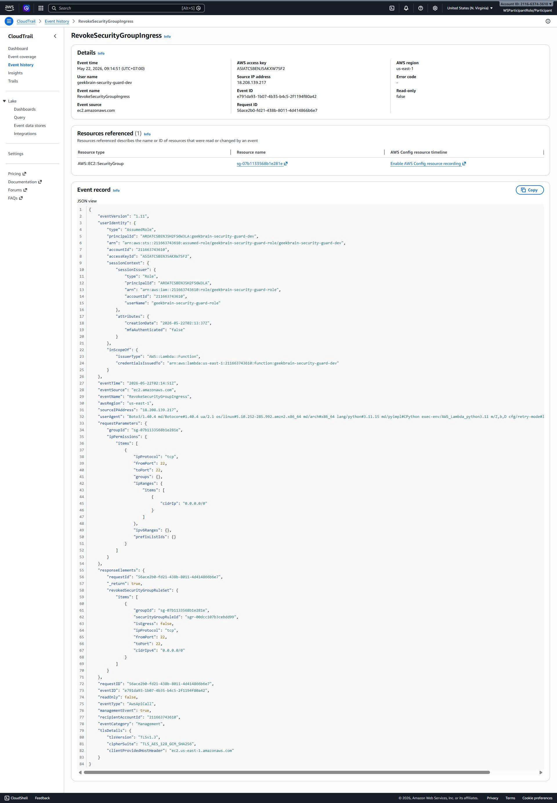

The CloudTrail event shows:
- `eventName`: `RevokeSecurityGroupIngress`
- `userIdentity.arn`: matches the Security Guard Lambda execution role
- Confirms the SG remediation was performed by automation — completing the second fix loop

### Bonus (+0.25): Cost Anomaly Automation & Account Limitations ADR

The implementation of Tag-based Cost Anomaly Detection encountered two strict permission boundaries imposed by the Payer Account on our Workshop Linked Account:
1. Inability to activate *User-defined tags* in the Billing Console (Access Denied).
2. Lack of permissions to create a *Custom Monitor* (error stating only AWS services monitors are allowed).

**Workaround & Architecture:** The team flexibly adapted by utilizing the **Managed by AWS (Service dimension)** Monitor to continue tracking anomalous spend. Crucially, the automated architecture flow remains fully intact: We implemented an **EventBridge Rule** (`geekbrain-cost-anomaly-rule`) that intercepts the `aws.costanomalydetection` event and wires it directly to the **SNS Topic `geekbrain-budget-alerts`**. This successfully distributes the alert to Email and triggers the Cost Guard Lambda. This demonstrates our ability to design and implement automated event-driven responses despite environmental permission constraints.

**Evidence:**
- Cost Anomaly Monitor created as Managed by AWS:
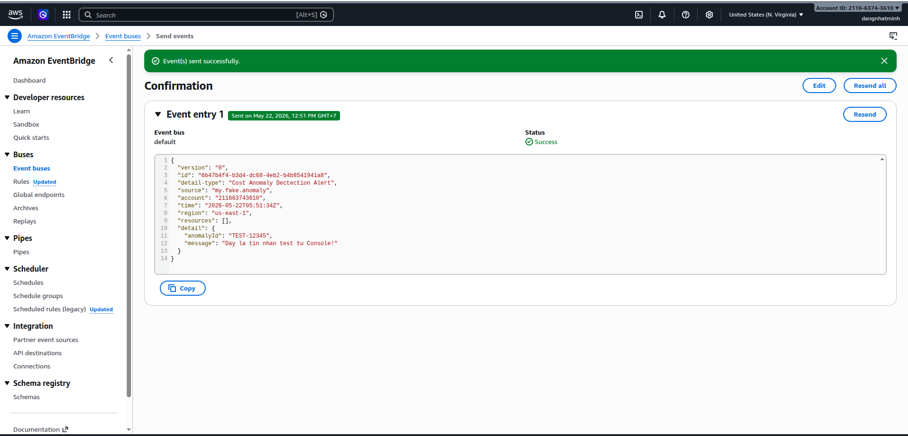

- EventBridge Rule capturing the anomaly event and wiring it to SNS:
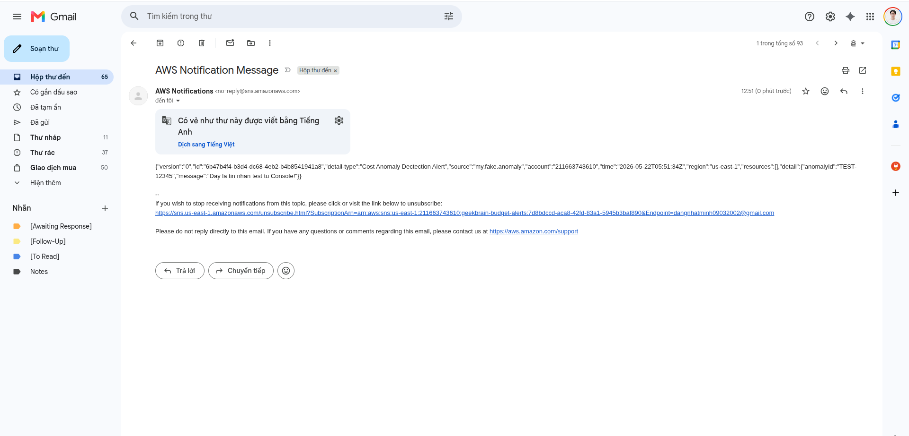
